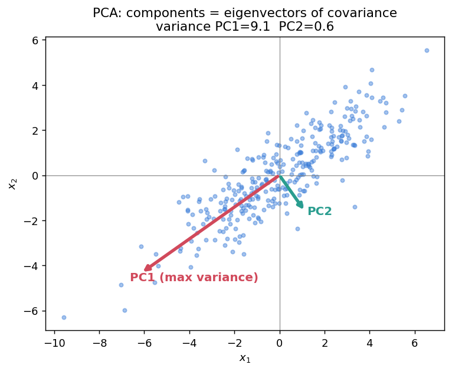

# 📘 Week 1 — Principal Component Analysis (PCA)

## 1. Why PCA?

High-dimensional data (many features) is hard to visualise, often **redundant** (correlated features carry the same info), and noisy. PCA replaces many correlated features with a few new ones — **principal components** — that capture most of the variation.

> **Key insight:** information lives in *variance*. A feature that never changes tells you nothing. PCA finds the directions where the data spreads out the most.

## 2. Intuition — the "cigar"

Picture a cloud of points shaped like a tilted cigar (an ellipse):



- **PC1** = along the length of the cigar (maximum variance).
- **PC2** = across the width (perpendicular, less variance).

To compress 2D → 1D, keep only PC1. You lose the tiny width variation but keep the big length variation.

## 3. The pipeline

**Step 1 — Center the data** (subtract the mean; PCA *requires* this):

```text
μ    = (1/n) Σᵢ xᵢ
xᵢ   ← xᵢ − μ
```

**Step 2 — Covariance matrix** (size d × d):

```text
C = (1/n) Σᵢ xᵢ xᵢ^T  =  (1/n) X X^T
```

- diagonal entries = variance of each feature
- off-diagonal entries = covariance between feature pairs
- C is symmetric and positive semi-definite (PSD)

**Step 3 — Eigen-decomposition:**

```text
C w = λ w
```

- eigenvectors `w` = principal component directions
- eigenvalues `λ` = variance along each direction

**Step 4 — Rank & select.** Sort `λ₁ ≥ λ₂ ≥ ... ≥ λ_d`. Keep the top `k` eigenvectors to reduce `d → k`.

## 4. Formulas to have ready

**Variance explained by top k components:**

```text
(λ₁ + ... + λₖ) / (λ₁ + ... + λ_d)
```

**Projection of x onto component w** ("scalar proxy" / new coordinate):

```text
z = w^T x
```

**Reconstruction error keeping top k** = sum of the *dropped* eigenvalues:

```text
error = λₖ₊₁ + ... + λ_d
```

**Compression ratio** (keeping k components on n points in ℝ^d):

```text
                 size of original          n × d
ratio  =  ──────────────────────────  =  ───────────
             size of reconstructed         k(n + d)
```

Storage of the reconstruction = `k` eigenvectors (each dimension `d`) **plus** `n` coefficient-vectors (each dimension `k`) = `k(n + d)`. Higher k → better reconstruction but worse compression.

## 5. Worked example — full eigen-decomposition

Covariance `C = [[4, 2], [2, 4]]`.

```text
det(C − λI) = 0
(4 − λ)² − 4 = 0
(4 − λ)² = 4   →   4 − λ = ±2
λ₁ = 6,   λ₂ = 2
```

Eigenvector for `λ₁ = 6`: solve `(C − 6I)w = 0` → `−2 w₁ + 2 w₂ = 0` → `w₁ = w₂` → direction `(1, 1)`, normalised `PC1 = (1/√2)(1, 1)`.

Eigenvector for `λ₂ = 2`: direction `(1, −1)` → `PC2 = (1/√2)(1, −1)`.

- PC1 captures variance 6, PC2 captures 2, total 8 → **PC1 explains 6/8 = 75%**.
- PC1 ⟂ PC2 (dot product = 0). ✅

## 6. Worked example — dimensionality decision

Eigenvalues `{10, 6, 3, 1, 0}` (5-D data).

- **Variance retained by top 2** = `(10 + 6) / 20 = 0.80` → 80%.
- **Reconstruction error keeping top 2** = `3 + 1 + 0 = 4`.
- **An eigenvalue of 0** means a direction with zero variance → the data actually lives in 4 dimensions; that feature is fully redundant and can be dropped with **no loss**.

## 7. Common exam traps

| Question | Answer |
|----------|--------|
| Do you center the data first? | **Yes, always.** |
| Are principal components unique? | Directions yes, **up to sign** (`w` and `−w` are the same). |
| Largest eigenvalue = ? | **Most important** component (max variance). |
| Is PCA supervised? | **No** — never looks at labels. |
| Are the new PCs correlated? | **No** — orthogonal ⇒ uncorrelated. |
| Variance along a component | equals its **eigenvalue**. |
| Data lies on a line → 2nd eigenvalue? | **0**. |
