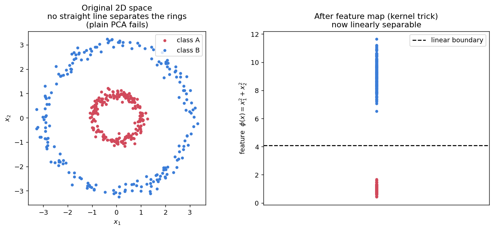

# 📗 Week 2 — Kernel PCA

## 1. What's wrong with plain PCA?

**Problem A — PCA is linear.** It only finds straight-line directions. If the data has a curved structure (e.g. two concentric circles, or a parabola), no straight line captures it.



The rings on the left cannot be separated by any straight line, so PCA is helpless. But after mapping each point to the feature `x₁² + x₂²` (its squared radius), the two classes become **linearly separable** (right panel).

**Problem B — time complexity.** Plain PCA builds a `d × d` covariance matrix and eigen-decomposes it in `O(d³)`. When `d` is huge, this is infeasible.

## 2. Feature transformation

Escape plan: map the data to a higher-dimensional space where it *becomes* linearly structured, then do ordinary PCA there.

```text
φ :  ℝ^d  →  ℝ^D      (D usually much larger)
x  ↦  φ(x)
```

Example (concentric circles → 3D):

```text
φ(x) = ( x₁² , x₂² , √2 x₁x₂ )
```

The radius information becomes a coordinate axis, so a flat plane can separate the rings.

## 3. The kernel trick

**The catch:** the feature space can be enormous or even infinite-dimensional, so computing `φ(x)` explicitly is impossible/expensive.

**The rescue:** PCA only ever needs **inner products** `φ(xᵢ)^T φ(xⱼ)`. A **kernel function** gives that directly, without computing `φ`:

```text
K(xᵢ, xⱼ) = φ(xᵢ)^T φ(xⱼ)
```

Verify with the example above:

```text
φ(a)^T φ(b) = a₁²b₁² + a₂²b₂² + 2 a₁a₂ b₁b₂ = (a₁b₁ + a₂b₂)² = (a^T b)²
```

So `K(a,b) = (a^T b)²` computed in the *original* space gives the same result — no trip to 3D needed. **That is the kernel trick.**

## 4. Common kernels

| Kernel | Formula | Notes |
|--------|---------|-------|
| Linear | `K = x^T y` | = plain PCA |
| Polynomial | `K = (x^T y + c)^p` | degree `p`, constant `c ≥ 0` |
| RBF / Gaussian | `K = exp(−‖x − y‖² / 2σ²)` | **infinite-dimensional** feature space |

**Polynomial kernel feature-space dimension** (input dimension `d`):

```text
inhomogeneous  (x^T y + c)^p  →  dim = C(d + p, p)      (all monomials of degree ≤ p)
homogeneous    (x^T y)^p      →  dim = C(d + p − 1, p)  (monomials of degree exactly p)
```

Example: parabola data, `d = 2`, `p = 2`, inhomogeneous → `C(4, 2) = 6` features `{1, x₁, x₂, x₁², x₂², x₁x₂}`.

## 5. The Kernel PCA procedure

1. Build the **kernel matrix** `K` of size **n × n** (n = number of points), `K[i][j] = K(xᵢ, xⱼ)`.
2. **Center the kernel matrix** (we can't center `φ(x)` directly, so we center K instead):

```text
K' = K − 𝟙ₙ K − K 𝟙ₙ + 𝟙ₙ K 𝟙ₙ      (𝟙ₙ = n × n matrix of 1/n)
```

3. Eigen-decompose `K'` to get the components in feature space.

## 6. Complexity punchline

| | Plain PCA | Kernel PCA |
|--|-----------|------------|
| Matrix | covariance, **d × d** | kernel, **n × n** |
| Cost | O(d³) | O(n³) |
| Best when | n large, d small | **d large (even infinite)**, n manageable |

Kernel PCA's cost depends on **n**, not on `d` or the feature-space dimension `D` — this is why RBF (infinite D) is still tractable.

## 7. Valid kernels — Mercer's condition

For `K` to correspond to some valid `φ` (a genuine inner product), the kernel matrix must be:

```text
1. Symmetric:              K(x, y) = K(y, x)
2. Positive semi-definite: all eigenvalues of K ≥ 0
```

This is **Mercer's theorem**. If a proposed kernel is **not symmetric**, it is immediately invalid (e.g. a function with an `x₁³x₂` term but no matching `x₁x₂³` term).

## 8. Worked example — RBF kernel value

Points `a = (1, 0)`, `b = (0, 1)`, `σ² = 1`:

```text
‖a − b‖² = 1 + 1 = 2
K(a, b) = exp(−2 / 2) = exp(−1) ≈ 0.368
```

Sanity check: `a = b` → `‖·‖² = 0` → `K = 1` (max similarity). RBF acts like a similarity score in `[0, 1]`.

## 9. Common exam traps

| Question | Answer |
|----------|--------|
| Size of the kernel matrix? | **n × n** (points), not d × d. |
| Do we compute φ(x)? | **No** — only `K(x, y)`. |
| Which kernel = infinite dims? | **RBF / Gaussian.** |
| Requirement for a valid kernel? | **Symmetric + PSD** (Mercer). |
| Do we skip centering? | **No** — center the *kernel matrix*. |
| When beats plain PCA? | Non-linear data, or huge `d`. |
