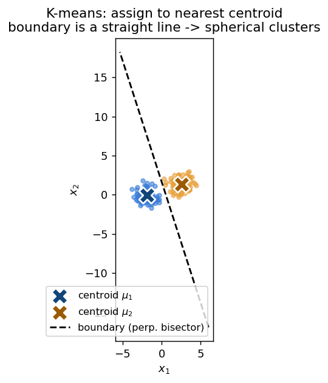
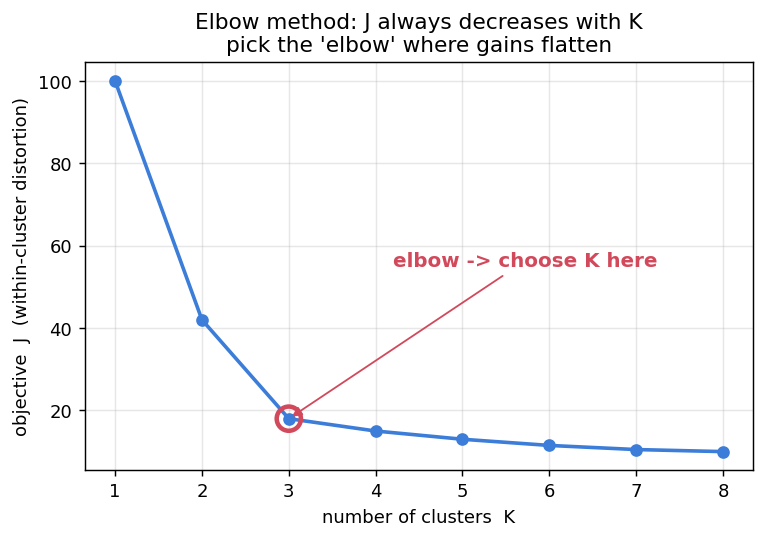

# 📙 Week 3 — Clustering & K-means

## 1. What is clustering?

Group data points so that points in the same group are **similar** (close) and points in different groups are **dissimilar** (far). Unsupervised — no labels.

- **PCA** reduces *dimensions* (representation).
- **Clustering** groups *points* (discovers groups).

## 2. The K-means objective

Split `n` points into `K` clusters, each with a centroid `μ_k`. Minimise the **within-cluster sum of squares** (distortion):

```text
J = Σ_k  Σ_{x ∈ C_k}  ‖x − μ_k‖²
```

Lower `J` = tighter clusters.

## 3. Lloyd's algorithm

```text
Step 0  INITIALISE: pick K centroids.

Repeat until assignments stop changing:
  Step 1  ASSIGN: each point → nearest centroid (squared Euclidean distance)
  Step 2  UPDATE: each centroid → mean of points assigned to it
```

Why the **mean**? It is exactly the point minimising the sum of squared distances to a set of points — so the update step is optimal for fixed assignments.



The boundary between two clusters is the **perpendicular bisector** of the segment joining their centroids — a straight line. Hence K-means produces **spherical / convex (Voronoi)** clusters.

## 4. Convergence

**K-means always converges.** Two-part argument:

1. **J never increases** — the assignment step (move to nearest) and the update step (move to mean) each can only lower or keep `J`.
2. **Finite assignments** — there are finitely many ways to assign points; since `J` is non-increasing and can't cycle, it must stop.

⚠️ **But it converges to a LOCAL minimum, not necessarily the global one.** The result depends on initialisation.

## 5. What clusters can K-means find?

- ✅ Works: blob-shaped, well-separated, similar-sized clusters.
- ❌ Fails: **non-convex shapes** (concentric circles, crescents), **very different sizes/densities**, **elongated** clusters.

> Memory hook: K-means loves round blobs, hates rings and moons.

## 6. K-means++ (smart initialisation)

Fixes bad random starts by spreading initial centroids apart:

```text
1. Pick the first centroid uniformly at random from the data.
2. For each point x, let D(x) = distance to the NEAREST chosen centroid.
3. Pick the next centroid with probability PROPORTIONAL to D(x)².
4. Repeat 2-3 until K centroids, then run normal Lloyd's.
```

The probability a specific point is chosen next:

```text
P(x chosen) = D(x)² / Σ_over_all_points D(·)²
```

## 7. Choosing K — the elbow method

You **can't** just minimise `J`: `J` always decreases as `K` grows (at `K = n`, `J = 0`). Instead:



```text
1. Run K-means for K = 1, 2, 3, ...
2. Plot J vs K.
3. Pick K at the "elbow" where adding clusters stops helping much.
```

## 8. Worked example — one iteration

Points `{1, 2, 9, 10}`, K = 2, initial `μ₁ = 1`, `μ₂ = 2`.

**Assign:** point 1 → C1; points 2, 9, 10 → nearer to 2 → C2.

```text
C1 = {1},  C2 = {2, 9, 10}
```

**Update:** `μ₁ = 1`, `μ₂ = (2 + 9 + 10)/3 = 7`.

Next assign with `μ₁ = 1, μ₂ = 7`: points 1, 2 → C1; 9, 10 → C2 → `C1 = {1,2}, C2 = {9,10}` → `μ₁ = 1.5, μ₂ = 9.5`. One more pass leaves it unchanged → **converged**: clusters `{1,2}` and `{9,10}`.

## 9. Worked example — computing J

Clusters `{2,3,4}` with `μ = 3` and `{10,12,20,30,11,25}` with `μ = 18`:

```text
Cluster 1: (2−3)² + (3−3)² + (4−3)² = 2
Cluster 2: 8² + 6² + 2² + 12² + 7² + 7² = 346
J = 2 + 346 = 348
```

## 10. Common exam traps

| Question | Answer |
|----------|--------|
| Always converges? | **Yes.** |
| Global or local min? | **Local** (depends on init). |
| Cluster shape assumed? | **Spherical / convex.** |
| Why not minimise J to pick K? | J always drops with K; use the **elbow**. |
| What does K-means++ change? | **Initialisation only** (prob ∝ D(x)²). |
| Distance used? | **Squared Euclidean.** |
| Is the update mean optimal? | **Yes.** |
