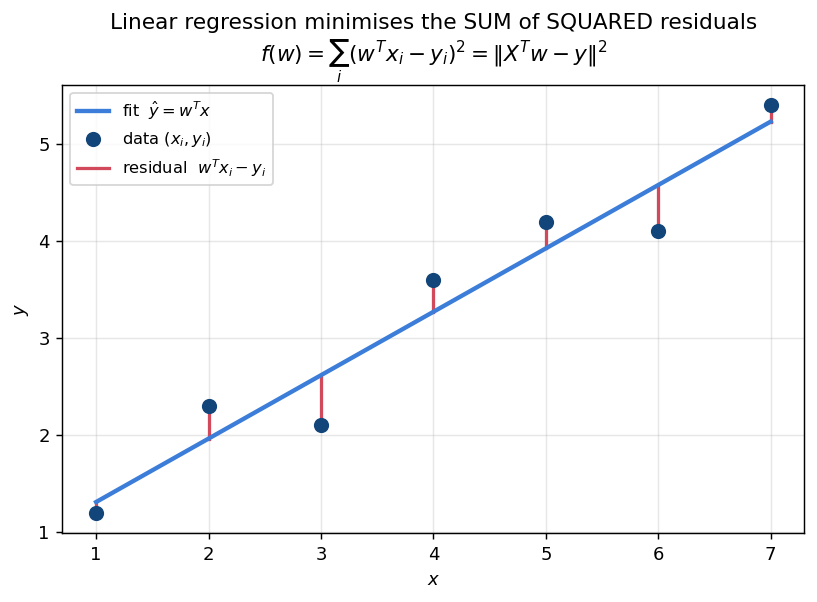
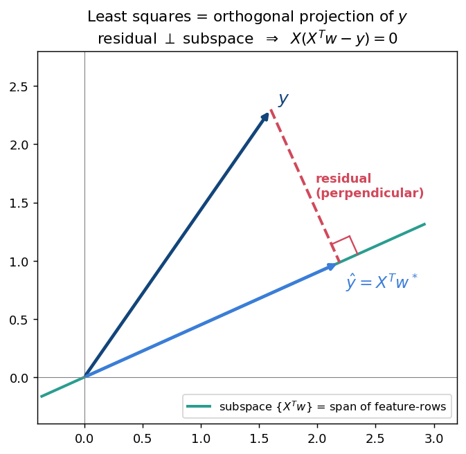
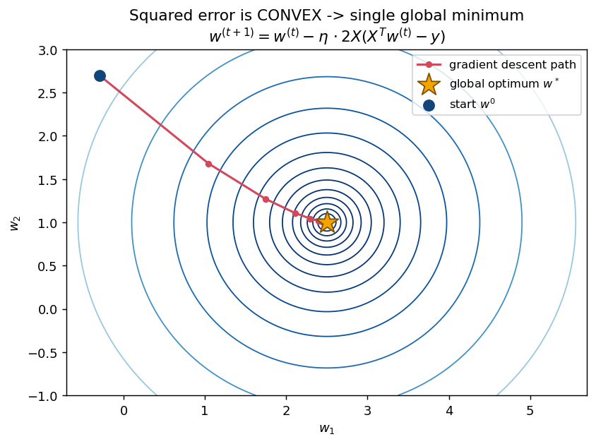
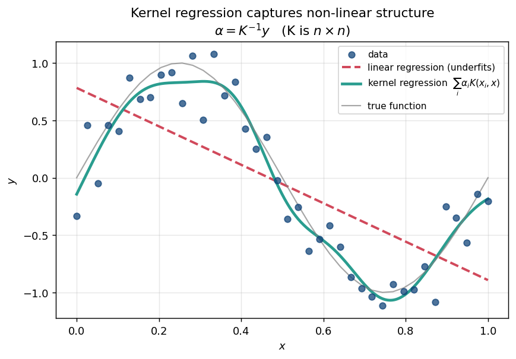

# 📒 Week 5 — Supervised Learning & Linear Regression

## 1. The shift: supervised vs unsupervised (5.1)

Weeks 1–4 were **unsupervised** — only `X` was available and we looked for structure. Now we also have **labels** `y`.

```text
Unsupervised:  data = {x₁, x₂, ..., xₙ}                  → find structure
Supervised:    data = {(x₁,y₁), (x₂,y₂), ..., (xₙ,yₙ)}   → learn a mapping x → y
```

Goal: learn `f` such that `f(x) ≈ y` for new, unseen `x`.

| Type | Label `y` | Example |
|------|-----------|---------|
| **Regression** | continuous, `y ∈ ℝ` | house price, temperature |
| **Classification** | discrete / categorical | spam vs not-spam, digit 0–9 |

**Week 5 covers regression.**

### Notation convention (drives every formula)

```text
X  =  d × n  matrix     (each COLUMN is a data point; d features, n points)
y  ∈  ℝⁿ                (one label per point)
w  ∈  ℝᵈ                (one weight per feature)
```

---

## 2. Linear regression (5.2)

Restrict `f` to be linear:

```text
prediction for one point x:   ŷ = w^T x
all n predictions at once:    ŷ = X^T w        (X^T is n × d, w is d × 1 → n × 1 ✓)
```

### The error function

```text
f(w)  =  Σᵢ (w^T xᵢ − yᵢ)²  =  ‖X^T w − y‖²
```



Each red segment is a **residual** `w^T xᵢ − yᵢ`. Least squares makes the **sum of their squares** as small as possible.

**Why squared error?**
1. Differentiable everywhere (unlike absolute error at 0).
2. Penalises large mistakes heavily.
3. **It is exactly MLE under Gaussian noise** — proved in §7. ← the exam favourite

> 🔑 **Goal:** `w* = argmin_w ‖X^T w − y‖²`

---

## 3. Optimizing the error function (5.3)

### Deriving the gradient

```text
f(w) = (X^T w − y)^T (X^T w − y)
     = w^T X X^T w − 2 y^T X^T w + y^T y

∇f(w) = 2 X X^T w − 2 X y
```

### Setting ∇f = 0 → the NORMAL EQUATIONS

```text
X X^T w  =  X y                 ← normal equations

w*  =  (X X^T)⁻¹ X y            ← closed-form solution
```

**The most important formula of Week 5.** Shapes:

```text
X X^T  is  d × d       (feature-by-feature)
X y    is  d × 1
```

### ⚠️ When `X X^T` is singular

Invertible only if `X` has full row rank (rank `d`), which needs `n ≥ d` and no redundant features. If singular (e.g. `n < d`, or perfectly correlated features):

- There are **infinitely many** optimal solutions.
- Use the **pseudo-inverse**: `w* = (X X^T)⁺ X y` → gives the minimum-norm solution.

### Computational cost — the motivation for gradient descent

```text
Forming X X^T :  O(n d²)
Inverting it  :  O(d³)      ← infeasible when d is large
```

---

## 4. Geometric interpretation (5.4)

### Where do predictions live?

Predictions are `ŷ = X^T w`. As `w` ranges over `ℝᵈ`:

```text
{ X^T w : w ∈ ℝᵈ }  =  column space of X^T
                    =  span of the d rows of X   (a subspace of ℝⁿ)
```

So `ŷ` is **trapped** in a subspace of dimension ≤ `d` inside `ℝⁿ`, while the true `y` is a general vector in `ℝⁿ` that usually **does not lie in it**.

### The insight

> We cannot reach `y`. The best we can do is the point of the subspace **closest** to `y` — the **orthogonal projection** of `y` onto that subspace.



"Closest in Euclidean distance" is precisely what minimising `‖X^T w − y‖²` means, so:

```text
Least squares  ≡  orthogonal projection of y onto span of the feature-rows
```

### This re-derives the normal equations

At the optimum the **residual** `r = X^T w* − y` must be ⟂ to the subspace, i.e. orthogonal to every row of `X`:

```text
X r = 0
X (X^T w* − y) = 0
X X^T w* = X y            ← the normal equations again ✓
```

Calculus and geometry give the same answer — a favourite discussion point.

### 🧮 Worked example — verify orthogonality

1-D data (`d = 1`, no intercept): `X = [1  2  3]` (1×3), `y = (1, 2, 2)`.

```text
X X^T = 1² + 2² + 3² = 14
X y   = 1(1) + 2(2) + 3(2) = 11
w*    = 11 / 14 ≈ 0.7857
```

Check the residual is perpendicular:

```text
predictions  X^T w* = (0.7857, 1.5714, 2.3571)
residual r = pred − y = (−0.2143, −0.4286, +0.3571)

X r = 1(−0.2143) + 2(−0.4286) + 3(0.3571)
    = −0.2143 − 0.8571 + 1.0714
    = 0    ✓  exactly as the geometry predicts
```

---

## 5. Gradient descent (5.5)

Because the closed form costs `O(d³)`, iterate downhill instead.

### The update rule

```text
w^(t+1)  =  w^(t)  −  η · ∇f(w^(t))

with  ∇f(w) = 2 X (X^T w − y)
```

`η` = learning rate / step size.



### Choosing η

| η | Behaviour |
|---|-----------|
| too **small** | converges, but very slowly |
| just right | fast, stable convergence |
| too **large** | overshoots, oscillates, **diverges** |

### Why it is guaranteed to work here

`f(w) = ‖X^T w − y‖²` is a **convex** quadratic (Hessian `2 X X^T` is PSD). For convex functions:

> ✅ Every local minimum is a **global** minimum.

So unlike **K-means** and **EM** (which get stuck in local optima), gradient descent on linear regression reaches the **global** optimum. **This contrast is very commonly tested.**

### Cost comparison

```text
Closed form:        O(d³)                  (one shot)
Gradient descent:   O(n d) per iteration   (many cheap steps)
```

A further variant, **stochastic gradient descent (SGD)**, uses one point (or a small batch) per step → `O(d)` per step.

### 🧮 Worked example — two GD steps

`X = [1 2 3]`, `y = (1, 2, 2)`, start `w⁰ = 0`, `η = 0.01`.

```text
Step 1
∇f(0) = 2X(X^T·0 − y) = −2 X y = −2(11) = −22
w¹ = 0 − 0.01(−22) = 0.22

Step 2
X^T w¹ = (0.22, 0.44, 0.66)
X^T w¹ − y = (−0.78, −1.56, −1.34)
X(X^T w¹ − y) = 1(−0.78) + 2(−1.56) + 3(−1.34) = −7.92
∇f = 2(−7.92) = −15.84
w² = 0.22 − 0.01(−15.84) = 0.3784
```

The iterates march toward the exact optimum `0.7857`, and the gradient shrinks (`−22 → −15.84`) — convergence in action.

---

## 6. Kernel regression (5.6)

Same idea as Week 2: if the relationship is **non-linear**, reuse the **kernel trick**.

### Step 1 — the key observation

The optimal `w*` always lies in the **span of the data points**:

```text
w* = (X X^T)⁻¹ X y  =  X · [(X X^T)⁻¹ y]  =  X α       for some α ∈ ℝⁿ
```

So **re-parameterise**: instead of `d` weights `w`, learn `n` coefficients `α` with `w = X α`.

### Step 2 — substitute and solve for α

```text
‖X^T w − y‖² = ‖X^T X α − y‖²

Let K = X^T X          ← the n × n KERNEL / GRAM matrix,  K[i][j] = xᵢ^T xⱼ

Setting the gradient to zero:   K α = y   ⇒   α = K⁻¹ y
```

### Step 3 — predict using kernels only

```text
ŷ(x) = w^T x = (Xα)^T x = α^T X^T x = Σᵢ αᵢ (xᵢ^T x)
```

Every appearance of the data is an **inner product**, so swap in any valid kernel:

```text
ŷ(x)  =  Σᵢ  αᵢ · K(xᵢ, x)          with   α = K⁻¹ y
```



With an RBF or polynomial kernel this gives **non-linear regression** without ever computing `φ`.

### Linear vs kernel regression

| | Linear regression | Kernel regression |
|--|-------------------|-------------------|
| Parameters | `w ∈ ℝᵈ` | `α ∈ ℝⁿ` |
| Solve | `(X X^T)⁻¹ X y`, **d × d** | `K⁻¹ y`, **n × n** |
| Cost | `O(d³)` | `O(n³)` |
| Fits | lines / hyperplanes | **curves** |
| Best when | `n` large, `d` small | `d` large, `n` manageable |

> The same `d` ↔ `n` trade-off as PCA vs Kernel PCA. 🔁

### 🧮 Worked example

Points `x₁ = (1,0)`, `x₂ = (0,1)`, labels `y = (2, 3)`, linear kernel `K(a,b) = a^T b`.

```text
K = [[1, 0],
     [0, 1]] = I        ⇒   α = K⁻¹ y = (2, 3)

Predict at x = (1, 1):
ŷ = α₁(x₁^T x) + α₂(x₂^T x) = 2(1) + 3(1) = 5
```

---

## 7. Probabilistic view of linear regression (5.7)

Answers: **why squared error and not something else?**

### The generative assumption

```text
yᵢ = w^T xᵢ + εᵢ        where  εᵢ ~ N(0, σ²), independent

⇒   yᵢ | xᵢ  ~  N(w^T xᵢ, σ²)
```

### Now apply MLE (Week 4 machinery)

```text
P(yᵢ | xᵢ, w) = (1 / √(2πσ²)) · exp( −(yᵢ − w^T xᵢ)² / (2σ²) )

ℓ(w) = Σᵢ log P(yᵢ | xᵢ, w)
     = −(n/2) log(2πσ²)  −  (1 / 2σ²) Σᵢ (yᵢ − w^T xᵢ)²
       └─ constant in w ─┘   └──── only w-dependent part ────┘
```

Maximising `ℓ(w)` ⟺ **minimising** `Σᵢ (yᵢ − w^T xᵢ)²` — exactly the squared-error loss.

### 🔑 The punchline

```text
Least squares  ≡  Maximum Likelihood Estimation under Gaussian noise
```

Squared error is not arbitrary — it is the *principled* choice **if** the noise is Gaussian. A different noise model gives a different loss (e.g. Laplacian noise → absolute error). This ties Week 5 back to Week 4's MLE.

---

## 8. The three views of the same thing

| View | Says | Gives |
|------|------|-------|
| **Algebraic** (5.3) | minimise `‖X^T w − y‖²`, set `∇ = 0` | `X X^T w = X y` |
| **Geometric** (5.4) | project `y` onto span of feature-rows | residual ⟂ subspace ⇒ same equations |
| **Probabilistic** (5.7) | MLE with Gaussian noise | same squared-error objective |

All three converge on the **normal equations**. Understanding why = understanding Week 5.

---

## 9. Common exam traps

| Question | Answer |
|----------|--------|
| Closed-form solution? | `w* = (X X^T)⁻¹ X y` |
| Size of `X X^T`? | **d × d** |
| Size of kernel matrix `K`? | **n × n** |
| If `X X^T` is singular? | infinitely many solutions → **pseudo-inverse** |
| Is the residual ⟂ to the predictions? | **Yes** — that is the optimality condition |
| Local or global optimum with GD? | **Global** (convex) — unlike K-means / EM |
| η too large? | oscillates / **diverges** |
| Why squared error? | **MLE under Gaussian noise** |
| Kernel regression prediction? | `ŷ(x) = Σᵢ αᵢ K(xᵢ, x)`, `α = K⁻¹ y` |
| Cost: closed form vs GD? | `O(d³)` vs `O(n d)` per step |
