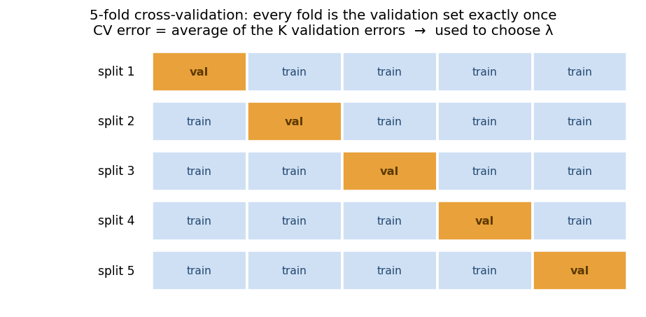
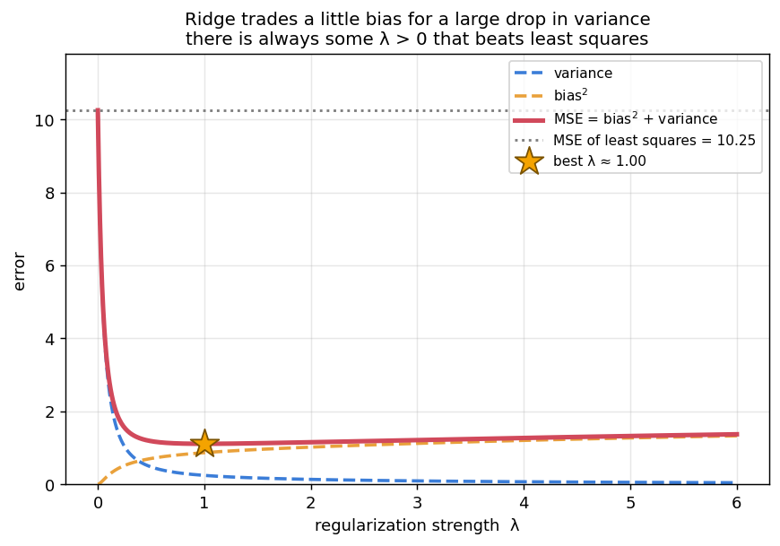
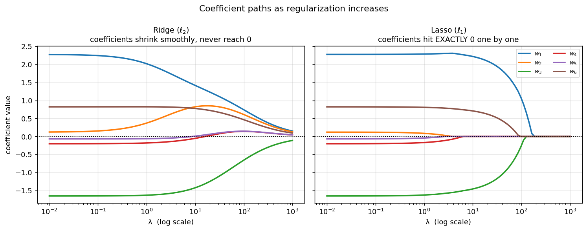
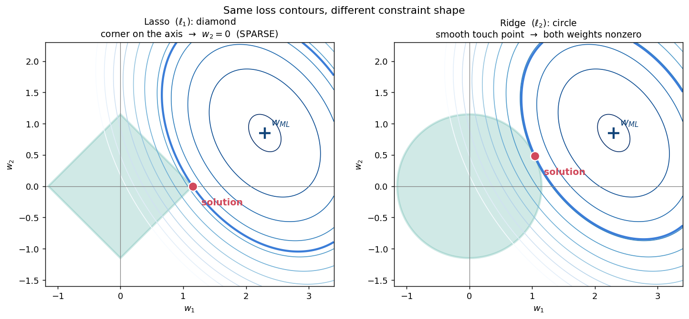

# 📓 Week 6 — Regularization: Ridge & Lasso

## 0. The story arc

Week 6 is one narrative, not seven disconnected topics:

```text
6.1  Least squares is UNBIASED... but its error can be enormous.  ← the problem
6.2  How do we even measure error on real data?                   ← the tool (CV)
6.3  Put a prior on w → Bayesian view                             ← the principle
6.4  That prior gives RIDGE regression                            ← the fix
6.5  Why ridge beats least squares (shrinkage)                    ← the proof
6.6  Swap the penalty → LASSO                                     ← the variant
6.7  Lasso gives SPARSITY (feature selection)                     ← the payoff
```

**Notation carried over from Week 5:** `X` is `d × n` (columns = points), `y ∈ ℝⁿ`, `w ∈ ℝᵈ`, and `w_ML = (X X^T)⁻¹ X y`.

---

## 1. Goodness of the MLE for linear regression (6.1)

Week 5 found `w_ML`. Now: **how close is it to the true `w`?**

### Setup

```text
y = X^T w + ε ,      ε ~ N(0, σ² I)
```

### Step 1 — Substitute

```text
w_ML = (X X^T)⁻¹ X y
     = (X X^T)⁻¹ X (X^T w + ε)
     = w  +  (X X^T)⁻¹ X ε

⇒  w_ML − w = (X X^T)⁻¹ X ε
```

### Step 2 — It is UNBIASED ✅

```text
E[w_ML] = w + (X X^T)⁻¹ X E[ε] = w        (since E[ε] = 0)
```

### Step 3 — But the MSE can explode ⚠️

Let `A = (X X^T)⁻¹ X`:

```text
MSE = E[‖Aε‖²] = E[ε^T A^T A ε] = σ² tr(A^T A) = σ² tr(A A^T)

A A^T = (X X^T)⁻¹ X X^T (X X^T)⁻¹ = (X X^T)⁻¹
```

```text
                                        d
MSE(w_ML)  =  σ² · tr((X X^T)⁻¹)  =  σ² Σ  1/λᵢ
                                       i=1
```

where `λ₁, ..., λ_d` are the **eigenvalues of `X X^T`**.

### 🔑 The punchline

> If even **one** eigenvalue `λᵢ ≈ 0`, then `1/λᵢ` explodes and the MSE becomes **enormous** — despite the estimator being perfectly unbiased.

This happens when features are **nearly collinear**, or when `d` is close to / larger than `n`.

### The theoretical tension

- `w_ML` **achieves the Cramér–Rao lower bound** ⇒ best possible **unbiased** estimator.
- But unbiased ≠ good. **Accepting a little bias** can slash variance and lower total MSE.

That trade is exactly ridge regression. 🎯

### 🧮 Worked example — why small eigenvalues hurt

`X X^T` has eigenvalues `λ₁ = 4`, `λ₂ = 0.1`, with `σ² = 1`:

```text
MSE(w_ML) = 1·(1/4 + 1/0.1) = 0.25 + 10 = 10.25
                    └─┬─┘      └─┬─┘
              well-determined    the tiny eigenvalue
                 direction       contributes 97.6% of the error
```

One badly-determined direction dominates everything.

---

## 2. Cross-validation for minimizing MSE (6.2)

**The problem:** the formula `σ² Σ 1/λᵢ` needs the true `w` and `σ²`, which we never have. And once there is a hyperparameter `λ`, we need a way to *choose* it.

**The solution:** estimate error on **held-out data**.



### K-fold cross-validation

```text
1. Split the data into K equal folds.
2. For each fold k = 1..K:
     - train on the other K−1 folds
     - validate on fold k, record the error
3. CV error = average of the K validation errors.
```

Every point is used for validation **exactly once** and for training `K−1` times.

### Leave-One-Out CV (LOOCV)

```text
K = n     → each fold is a single point
```

Most thorough, most expensive (`n` model fits).

### How it is used to pick λ

```text
for each candidate λ in {0.01, 0.1, 1, 10, 100}:
      compute the K-fold CV error
choose the λ with the LOWEST CV error
then retrain on ALL the data using that λ
```

> ⚠️ **Trap:** never choose `λ` by **training** error — it always prefers `λ = 0`. And never tune on the test set; that leaks information.

---

## 3. Bayesian modeling for linear regression (6.3)

### The idea

Week 5's probabilistic view treated `w` as a fixed unknown. Now put a **prior** on `w` (Week 4 style):

```text
Prior:       w ~ N(0, γ² I)            ← "weights are probably small, near 0"
Likelihood:  y | X, w ~ N(X^T w, σ² I)
```

### Derive the posterior

```text
posterior  ∝  likelihood × prior

P(w | X, y)  ∝  exp( −‖X^T w − y‖² / 2σ² ) · exp( −‖w‖² / 2γ² )
```

Take `−log`, drop constants: maximizing the posterior (**MAP**) means minimizing

```text
   1                      1
 ─────  ‖X^T w − y‖²  +  ─────  ‖w‖²
 2σ²                     2γ²
```

Multiply by `2σ²`:

```text
minimize    ‖X^T w − y‖²  +  (σ²/γ²) ‖w‖²
```

### 🔑 The punchline

> **This IS ridge regression**, with

```text
λ = σ² / γ²
```

| Situation | `λ` | Meaning |
|---|---|---|
| noisy data (`σ²` large) | large | trust the data less → regularize more |
| confident prior (`γ²` small) | large | strong belief `w ≈ 0` → shrink hard |
| vague prior (`γ² → ∞`) | `→ 0` | no prior info → back to plain MLE |

Ridge is not an arbitrary hack — it is **MAP estimation with a Gaussian prior**.

### 🧮 Worked example

Noise `σ² = 4`, prior variance `γ² = 2`  ⇒  `λ = 4/2 = 2`.

---

## 4. Ridge regression (6.4)

### Objective and solution

```text
minimize    f(w) = ‖X^T w − y‖²  +  λ ‖w‖²        (λ > 0)

∇f = 2X(X^T w − y) + 2λw = 0
⇒  (X X^T + λI) w = X y

⇒  w_ridge = (X X^T + λI)⁻¹ X y
```

### Why the `λI` is magic 🪄

`X X^T` is PSD, so adding `λI` lifts **every** eigenvalue by `λ`:

```text
eigenvalues of (X X^T + λI)  =  λᵢ + λ  >  0    for all i
```

Consequences:

- ✅ **Always invertible** (strictly positive definite).
- ✅ Works even when `d > n`, where `X X^T` is *guaranteed* singular.
- ✅ Works with perfectly collinear features.
- ✅ The solution is always **unique** (Week 5: plain least squares had infinitely many when singular).

### Limiting behaviour

```text
λ → 0    ⇒   w_ridge → w_ML       (no regularization)
λ → ∞    ⇒   w_ridge → 0          (everything crushed)
```

Choose `λ` in between, by **cross-validation** — which is why §2 precedes §4.

### 🧮 Worked example

`X = [1  2  3]`, `y = (1, 2, 2)` (the Week 5 example), `λ = 2`:

```text
X X^T = 14 ,   X y = 11

w_ML    = 11 / 14      = 0.7857
w_ridge = 11 / (14+2)  = 11/16 = 0.6875     ← shrunk toward 0
```

That shift is the bias we accepted, in exchange for reduced variance.

---

## 5. Relation between least squares and ridge (6.5)

The most elegant part of the week, and a **guaranteed exam target**.

### Set up the eigenbasis

```text
X X^T = Q Λ Q^T      Q orthonormal (Q^T Q = I),  Λ = diag(λ₁, ..., λ_d)
```

### Rewrite ridge in terms of `w_ML`

Using `X y = (X X^T) w_ML = Q Λ Q^T w_ML`:

```text
w_ridge = (X X^T + λI)⁻¹ X y
        = (Q Λ Q^T + λ Q Q^T)⁻¹ · Q Λ Q^T w_ML
        = Q (Λ + λI)⁻¹ Q^T · Q Λ Q^T w_ML
        = Q (Λ + λI)⁻¹ Λ Q^T w_ML
```

### 🔑 The shrinkage formula

With `α = Q^T w_ML` and `β = Q^T w_ridge`, coordinate by coordinate:

```text
        λᵢ
βᵢ  =  ───────  ·  αᵢ           (always between 0 and 1)
       λᵢ + λ
```

### Why this is exactly the right fix 🎯

| Direction | Shrink factor `λᵢ/(λᵢ+λ)` | Effect |
|---|---|---|
| **large `λᵢ`** (well-determined) | `≈ 1` | barely touched — we trust it |
| **small `λᵢ`** (poorly determined) | `≈ 0` | crushed — it was mostly noise |

From §1 the MSE was `σ² Σ 1/λᵢ`, so the **small-`λᵢ` directions were precisely the ones blowing up the error**. Ridge selectively suppresses exactly those. Not a blunt instrument — a scalpel. ✨

### The MSE theorem

Decomposing MSE into bias² + variance in the eigenbasis:

```text
              d ⎡  σ² λᵢ           λ² αᵢ²   ⎤
MSE(λ)  =    Σ  ⎢ ────────    +   ──────── ⎥
             i=1⎣ (λᵢ+λ)²         (λᵢ+λ)²  ⎦
                 └─variance─┘     └─bias²─┘
```

At `λ = 0` this reduces to `σ² Σ 1/λᵢ` ✓ (matches §1).



> **Theorem:** there always exists some `λ > 0` such that `MSE(w_ridge) < MSE(w_ML)`.

In words: **you can always beat least squares by regularizing a little.** This is why "best unbiased" (§1) is not the same as "best".

### 🧮 Worked example — shrinkage factors

Eigenvalues `λ₁ = 4`, `λ₂ = 0.1` (from §1), with `λ = 0.9`:

```text
direction 1:  4 / (4 + 0.9)     = 4/4.9   ≈ 0.816   → kept ~82%
direction 2:  0.1 / (0.1 + 0.9) = 0.1/1.0 = 0.100   → kept only 10%
```

The trustworthy direction survives; the noise-dominated one is suppressed by 90%.

---

## 6. Relation between least squares and Lasso (6.6)

Now change **which norm** is penalized.

```text
Ridge (ℓ2):   minimize  ‖X^T w − y‖²  +  λ ‖w‖²     ,  ‖w‖² = Σ wᵢ²
Lasso (ℓ1):   minimize  ‖X^T w − y‖²  +  λ ‖w‖₁    ,  ‖w‖₁ = Σ |wᵢ|
```

("Lasso" = Least Absolute Shrinkage and Selection Operator.)

### ⚠️ There is NO closed form

`|wᵢ|` is **not differentiable at 0**, so we cannot set `∇ = 0` and invert a matrix. Lasso is solved **iteratively** — sub-gradient descent, coordinate descent, or proximal methods.

> **Very common exam question.** Ridge: closed form ✅. Lasso: no closed form ❌.

### The one case solvable by hand: orthonormal features

If `X X^T = I` (so `X y = w_ML`), the objective **separates** per coordinate:

```text
‖X^T w − y‖² + λ‖w‖₁  =  Σᵢ [ wᵢ² − 2 wᵢ (w_ML)ᵢ + λ|wᵢ| ]  + const
```

Minimizing each term gives **soft-thresholding**:

```text
(w_lasso)ᵢ  =  sign((w_ML)ᵢ) · max( |(w_ML)ᵢ| − λ/2 ,  0 )
```

Ridge in the same orthonormal setting:

```text
(w_ridge)ᵢ  =  (w_ML)ᵢ / (1 + λ)
```

### 🔑 The crucial structural difference

```text
Ridge:   multiplies by 1/(1+λ)      → shrinks proportionally, NEVER exactly 0
Lasso:   subtracts λ/2 then clips   → coefficients hit EXACTLY 0
```



### 🧮 Worked example — sparsity in action

Orthonormal features, `w_ML = (3, −0.4, 0.1)`, `λ = 1` (threshold `λ/2 = 0.5`):

**Lasso:**

```text
w₁:  |3|    = 3.0 > 0.5   →  sign(+)·(3.0 − 0.5) = 2.5
w₂:  |−0.4| = 0.4 < 0.5   →  0          ← eliminated
w₃:  |0.1|  = 0.1 < 0.5   →  0          ← eliminated

w_lasso = (2.5, 0, 0)        ← SPARSE: 2 features dropped
```

**Ridge (same λ = 1):**

```text
w_ridge = w_ML / 2 = (1.5, −0.2, 0.05)     ← all three still nonzero
```

Same data, same `λ`, completely different character.

---

## 7. Characteristics of Lasso regression (6.7)

### The headline: SPARSITY

Lasso drives some coefficients to **exactly zero**, performing **automatic feature selection**. The surviving nonzero weights show which features actually matter, which makes models **interpretable**.

### Why does ℓ1 produce zeros? (geometric argument)

View regularization as a **constrained** problem:

```text
minimize ‖X^T w − y‖²   subject to   ‖w‖₁ ≤ t     (lasso)
minimize ‖X^T w − y‖²   subject to   ‖w‖²  ≤ t     (ridge)
```

Loss contours are **ellipses** centred at `w_ML`. The solution is where the smallest ellipse first **touches** the constraint region:

```text
ℓ1 region  =  DIAMOND  → sharp CORNERS, and the corners lie ON THE AXES
ℓ2 region  =  CIRCLE   → perfectly round, no corners
```



- An expanding ellipse very often first touches the diamond **at a corner** — and a corner has `wᵢ = 0` for some coordinate ⇒ **sparsity**.
- A circle has no corners, so the touch point generically has **all coordinates nonzero** ⇒ no sparsity.

### The Bayesian counterpart

```text
Ridge  ⇔  Gaussian prior     N(0, γ²)         (smooth, round)
Lasso  ⇔  Laplace prior      ∝ exp(−|w|/b)    (sharp peak at 0)
```

The Laplace prior's spike at zero is the probabilistic reason lasso favours exact zeros.

### Master comparison table

| | **Ridge (ℓ2)** | **Lasso (ℓ1)** |
|---|---|---|
| Penalty | `λ‖w‖²` | `λ‖w‖₁` |
| Closed form? | ✅ `(X X^T + λI)⁻¹ X y` | ❌ iterative only |
| Sparsity? | ❌ shrinks, never exactly 0 | ✅ **exact zeros** |
| Feature selection? | ❌ | ✅ |
| Bayesian prior | Gaussian | Laplace |
| Constraint shape | circle / sphere | **diamond** (corners) |
| Orthonormal solution | `w_ML/(1+λ)` | soft-threshold at `λ/2` |
| Correlated features | keeps all, shares weight | tends to pick one |
| Best when | many features matter a little | **few features matter a lot** |

### Both share these properties

- Hyperparameter `λ` chosen by **cross-validation** (§2).
- Introduce **bias** to reduce **variance** → can beat least squares in MSE.
- **Convex** objectives ⇒ **global** optimum (unlike K-means / EM).
- `λ → 0` recovers least squares; `λ → ∞` drives `w → 0`.

---

## 8. Common exam traps

| Question | Answer |
|---|---|
| Is `w_ML` biased? | **No** — unbiased. |
| `MSE(w_ML)` = ? | `σ² Σᵢ 1/λᵢ` (eigenvalues of `X X^T`) |
| When does the MLE fail badly? | when some `λᵢ ≈ 0` (collinear features, `d ≳ n`) |
| Is `w_ML` the best estimator? | best **unbiased** (Cramér–Rao) — biased ones can have lower MSE |
| Ridge solution? | `w_ridge = (X X^T + λI)⁻¹ X y` |
| Is `X X^T + λI` always invertible? | **Yes** for `λ > 0` (eigenvalues `λᵢ + λ > 0`) |
| Ridge = MAP with which prior? | **Gaussian**, with `λ = σ²/γ²` |
| Ridge shrinkage factor? | `λᵢ / (λᵢ + λ)` |
| Which directions shrink most? | those with **small `λᵢ`** |
| Does ridge give sparsity? | **No.** |
| Does lasso have a closed form? | **No** (ℓ1 not differentiable at 0) |
| Lasso, orthonormal case? | soft-threshold: `sign(·)·max(|·| − λ/2, 0)` |
| Why is lasso sparse? | the ℓ1 **diamond has corners on the axes** |
| Lasso = MAP with which prior? | **Laplace** |
| How to choose `λ`? | **cross-validation** (never training error) |
