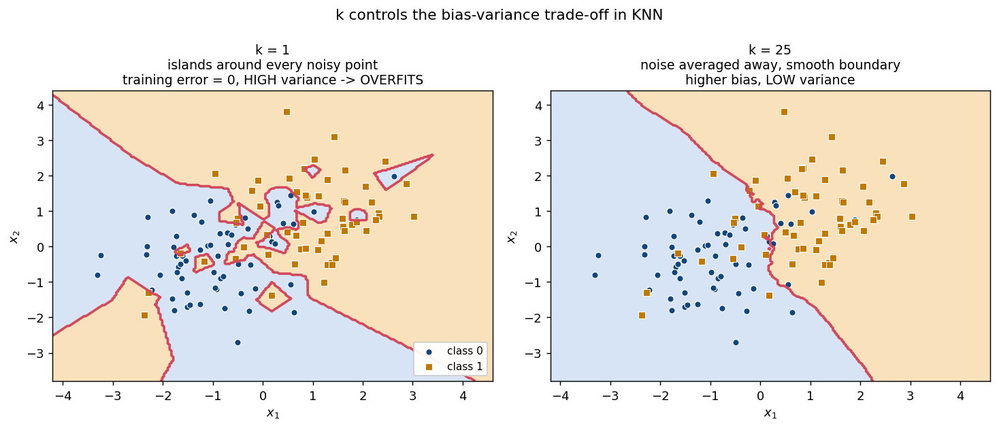
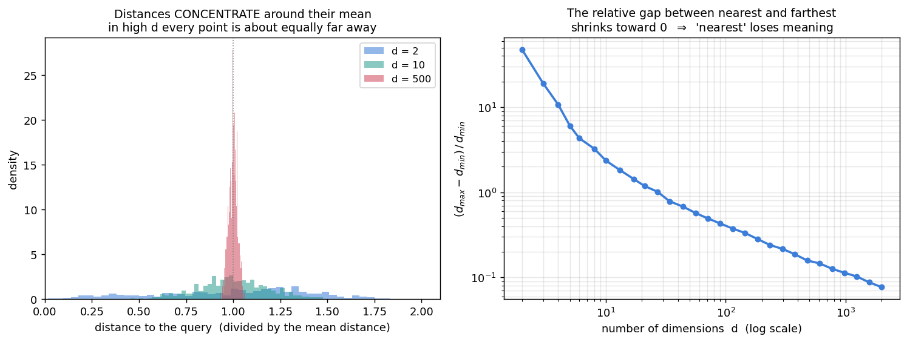
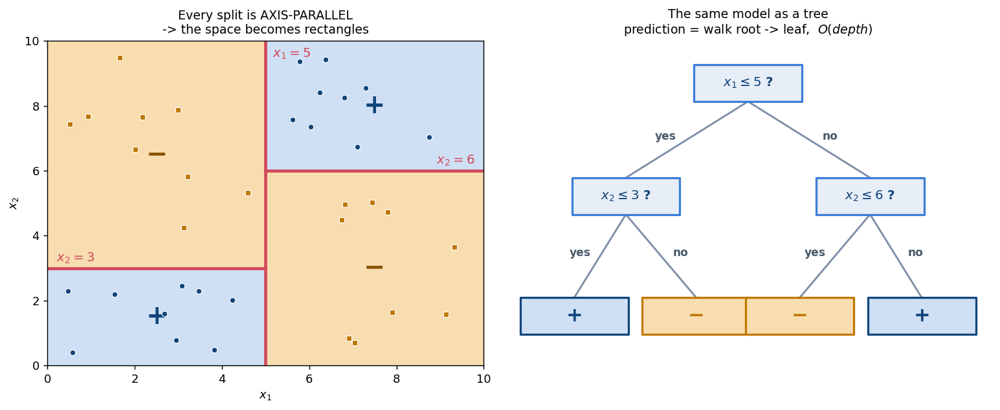
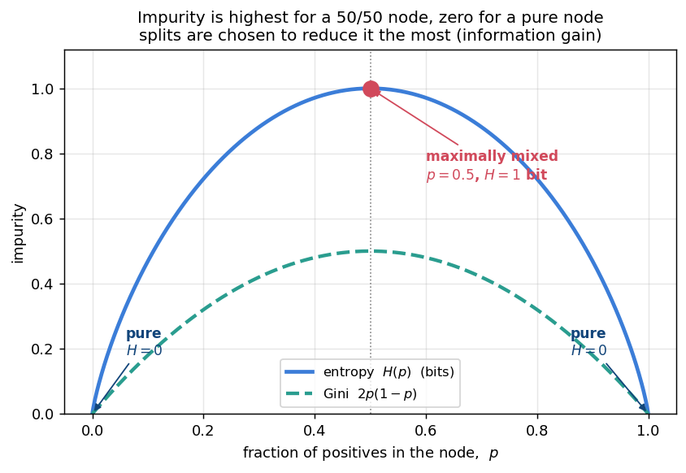
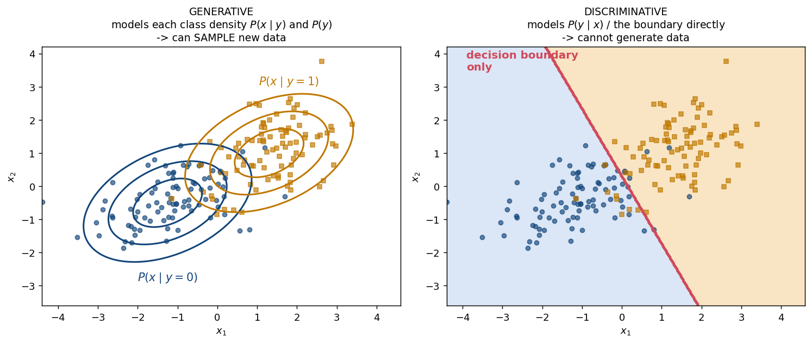

# 📔 Week 7 — Binary Classification, KNN & Decision Trees

## 0. Where this sits

```text
Week 5-6:  Supervised REGRESSION      →  y ∈ ℝ        (continuous)
Week 7:    Supervised CLASSIFICATION  →  y ∈ {0,1}    (discrete)
```

A philosophical shift too: Weeks 5–6 were all *"write a loss, take the gradient, solve."* Week 7's two algorithms — **KNN** and **decision trees** — do **neither**. No gradients, no closed forms.

---

## 1. Introduction to Binary Classification (7.1)

### The setup

```text
data:    {(x₁,y₁), ..., (xₙ,yₙ)}       xᵢ ∈ ℝᵈ ,  yᵢ ∈ {0, 1}
goal:    learn  h : ℝᵈ → {0, 1}
```

`h` is a **classifier**. It carves the input space into regions; the surface between them is the **decision boundary**.

### The 0-1 loss

```text
                 n
error(h)  =  1/n Σ  𝟙( h(xᵢ) ≠ yᵢ )        𝟙 = 1 if true, 0 if false
                i=1
```

The fraction of misclassified points.

### ⚠️ Why this changes everything

The 0-1 loss is **non-convex** and **non-differentiable** — a step function:

```text
   loss
    1 │────────┐
      │        │
    0 │        └────────
      └──────────────────→  h(x)
```

The gradient is **zero almost everywhere** and undefined at the jump.

> 🔑 **You cannot minimize the 0-1 loss with gradient descent.** This one fact explains the shape of Week 7 (algorithms that sidestep optimization) and of later weeks (smooth *surrogate* losses).

### How large is the space of classifiers?

With `d` **binary** features:

```text
number of possible inputs      = 2ᵈ
number of possible classifiers = 2^(2ᵈ)
```

`d = 2` → `2⁴ = 16`. `d = 10` → `2¹⁰²⁴`, more than atoms in the universe.

**Why it matters:** with a space that vast, some classifier will always fit the training data perfectly by memorizing it, and generalize terribly. So we must **restrict** the function class (linear boundaries, shallow trees, ...). That restriction is **inductive bias**, and it is what makes learning possible.

### The gold standard: Bayes optimal classifier

```text
h*(x) = argmax_y  P(y | x)
```

Its error is the **Bayes error** — an irreducible floor caused by genuine class overlap. No algorithm can beat it; everything else approximates `h*` from finite data.

---

## 2. K-Nearest Neighbours (7.2)

The simplest idea possible: **similar inputs should have similar labels.**

### The algorithm

```text
TRAINING:  store the dataset.  (that is all)

PREDICT for a new x:
  1. compute the distance from x to ALL n training points
  2. keep the k closest
  3. return the MAJORITY label among those k
```

Distance is usually Euclidean, `‖x − xᵢ‖`. Because training does no work, KNN is a **lazy learner**, and it is **non-parametric** — there are no weights, the data *is* the model.

### 🧮 Worked example — how `k` changes the answer

```text
P₁ = (1, 2) → +          P₄ = (6, 5) → −
P₂ = (2, 3) → +          P₅ = (7, 7) → −
P₃ = (3, 1) → −
```

Classify `q = (3, 3)`:

```text
d(q, P₂) = √(1² + 0²) = 1.000    →  +
d(q, P₃) = √(0² + 2²) = 2.000    →  −
d(q, P₁) = √(2² + 1²) = 2.236    →  +
d(q, P₄) = √(3² + 2²) = 3.606    →  −
d(q, P₅) = √(4² + 4²) = 5.657    →  −
```

| `k` | neighbours | votes | **prediction** |
|---|---|---|---|
| 1 | P₂ | 1+ , 0− | **+** |
| 3 | P₂, P₃, P₁ | 2+ , 1− | **+** |
| 5 | all | 2+ , 3− | **−** |

> Same query, same data, and the answer **flips** with `k`. A classic exam setup.

### `k` is a bias-variance dial



| | `k = 1` | large `k` |
|---|---|---|
| Boundary | jagged, islands around noise | smooth |
| Training error | **exactly 0** (each point is its own neighbour) | higher |
| Variance | **high** | low |
| Bias | low | **high** |
| Risk | **overfitting** | **underfitting** |

Extreme `k = n`: every prediction is the overall majority class; the boundary disappears.

**Choose `k` by cross-validation** (Week 6's tool). Use **odd** `k` for binary problems to avoid tied votes.

### Geometry: `k = 1` is a Voronoi tessellation

For `k = 1` the space splits into one cell per training point. Cell walls are perpendicular bisectors, so the boundary is **piecewise linear**.

> Same Voronoi structure as **K-means** (Week 3) — but K-means *learns* a few centroids unsupervised, while 1-NN uses *every labelled point* as its own cell.

### ⚠️ Problem 1: the cost is at test time

```text
Training:    O(1)        ← free
Prediction:  O(n d)      ← per query! touches every stored point
Storage:     O(n d)      ← the whole dataset, forever
```

The exact **opposite** of linear regression (expensive training, cheap `O(d)` predictions).

### ⚠️ Problem 2: the curse of dimensionality



In high dimensions distances **concentrate** — nearest and farthest end up almost equally far:

```text
        d_max − d_min
       ───────────────   ──────→   0     as d → ∞
           d_min
```

If everything is equidistant, "nearest neighbour" carries **no information**. This is *the* fundamental weakness of KNN, and why dimensionality reduction (**PCA**, Week 1) is often applied first.

### ⚠️ Problem 3: feature scaling

Euclidean distance treats all features equally, so a feature in *metres* will dominate one in *kilometres* purely by units. **Always normalize before KNN.**

### A theoretical gem

As `n → ∞`, the 1-NN error is at most **twice** the Bayes error (**Cover–Hart** inequality). Remarkably strong for so naive an algorithm.

---

## 3. Introduction to Decision Trees (7.3)

A different idea: ask a **sequence of yes/no questions**.

- **Internal nodes** = a test on one feature
- **Branches** = outcomes
- **Leaves** = predicted labels

Prediction walks root → leaf in `O(depth)`, and the model is **interpretable** — readable as plain rules.

### Geometry: axis-parallel rectangles



Each test `xⱼ ≤ t` cuts **perpendicular to one axis**, so a tree carves the space into **axis-parallel boxes**.

> Contrast: linear models give *one* boundary at any angle. A tree gives *many* boundaries, but each must be axis-parallel — so a diagonal boundary needs a staircase of many splits to approximate.

### Which split is best? Measuring impurity

#### Entropy

```text
H(p) = − p log₂ p − (1−p) log₂ (1−p)          (bits;  convention 0·log0 = 0)
```



```text
p = 0    →  H = 0     pure               ← best
p = 0.5  →  H = 1     maximally mixed    ← worst
p = 1    →  H = 0     pure               ← best
```

#### Information Gain — the split criterion

```text
                                      |Dᵥ|
IG(D, split)  =  H(D)  −     Σ       ────── · H(Dᵥ)
                          v ∈ children  |D|
                 └parent┘   └─weighted average child impurity─┘
```

> **Pick the split with the largest information gain.** IG is always `≥ 0`.

#### Gini impurity (alternative)

```text
Gini(p) = 1 − Σ_c p_c²  =  2p(1−p)      for binary
```

Behaves like entropy (peaks at `p = 0.5`, zero when pure) but avoids logarithms.

### 🧮 Worked example — choosing a split

Node with **4 positives, 4 negatives** (`p = 0.5`), so `H(parent) = 1` bit.

**Feature A** → `[3+, 1−]` and `[1+, 3−]`:

```text
H(3/4) = −0.75 log₂0.75 − 0.25 log₂0.25
       = 0.75(0.415) + 0.25(2) = 0.311 + 0.5 = 0.811
both children: H = 0.811

IG(A) = 1 − (4/8)(0.811) − (4/8)(0.811) = 1 − 0.811 = 0.189
```

**Feature B** → `[4+, 0−]` and `[0+, 4−]`:

```text
H(children) = 0 and 0          ← perfectly pure

IG(B) = 1 − 0 − 0 = 1.000      ← maximum possible gain
```

**Choose B** — it separates the classes completely in one question.

---

## 4. The Decision Tree Algorithm (7.4)

### Greedy recursive construction (ID3 / CART)

```text
BuildTree(D):
    if stopping condition met:
        return a LEAF labelled with the majority class of D

    best_split = None ;  best_gain = 0
    for each feature j:
        for each candidate threshold t:
            gain = IG(D, split on xⱼ ≤ t)
            if gain > best_gain:  best_gain, best_split = gain, (j, t)

    if best_gain == 0:  return LEAF (majority class)

    split D into D_left, D_right using best_split
    return NODE( best_split,
                 BuildTree(D_left),
                 BuildTree(D_right) )
```

For a numeric feature, candidate thresholds are the **midpoints between consecutive sorted values** — only those change the partition.

### Stopping conditions

```text
- node is PURE (all one class)
- maximum depth reached
- fewer than a minimum number of samples in the node
- no split gives positive information gain
```

### ⚠️ Two crucial caveats

**1. Greedy ≠ optimal.** Each node takes the *locally* best split and never reconsiders, which can miss a better overall tree. Finding the optimal decision tree is **NP-hard**, so greedy is the practical compromise.

> A *third* flavour of "not globally optimal": K-means/EM get stuck in local optima of a continuous objective; trees are greedy over a discrete structure; ridge/lasso are convex and **do** find the global optimum.

**2. Trees overfit aggressively.** Grown deep enough, every leaf holds one point → **zero training error**, terrible generalization. This is `k = 1` KNN in different clothing.

**Remedies** (all hyperparameters → tune by **cross-validation**):

```text
- limit max depth
- require a minimum number of samples per leaf
- require a minimum information gain to split
- PRUNING: grow the full tree, then cut back branches
           that do not improve validation performance
```

### Strengths and weaknesses

| ✅ Strengths | ❌ Weaknesses |
|---|---|
| Interpretable (readable rules) | Overfits easily |
| No feature scaling needed | Boundaries only **axis-parallel** |
| Handles numeric + categorical | **High variance** — small data change ⇒ very different tree |
| Fast prediction `O(depth)` | Greedy, not globally optimal |

> That high variance is exactly what **ensembles** (bagging / random forests) are invented to fix — average many trees to cancel their instability.

---

## 5. Generative and Discriminative Models (7.5)

A framing that classifies the *classifiers*.

### Discriminative

Model the boundary — or `P(y | x)` — **directly**.

```text
learn:    P(y | x)      or just the decision function h(x)
question: "which side of the boundary is x on?"
```

Examples: **logistic regression, SVM, decision trees, KNN**, neural networks.

### Generative

Model how data is **generated** per class, then invert with Bayes' rule.

```text
learn:    P(x | y)   (class-conditional density)   and   P(y)   (class prior)

                     P(x | y) P(y)
        P(y | x) =  ───────────────
                          P(x)

predict:  h(x) = argmax_y  P(x | y) · P(y)      ← P(x) is constant, drop it
```

Examples: **Naive Bayes**, GMM-based classifiers, LDA.



### 🔑 The defining difference

> A **generative** model learns enough to **synthesize new data** — sample from `P(x | y)` and get a brand-new plausible `x`. A **discriminative** model only knows where the dividing line is.

### Comparison

| | **Generative** | **Discriminative** |
|---|---|---|
| Models | `P(x\|y)` and `P(y)` | `P(y\|x)` or `h(x)` directly |
| Uses | Bayes' rule to classify | direct prediction |
| Can generate new data? | ✅ **Yes** | ❌ No |
| Assumptions | stronger (a form for `P(x\|y)`) | weaker |
| Small data | often **better** | can overfit |
| Large data | assumptions may hurt | usually **better** |
| Examples | Naive Bayes, GMM, LDA | logistic regression, SVM, trees, KNN |

### 🧮 Worked example — classifying with Bayes' rule

```text
P(y=1) = 0.3        P(x | y=1) = 0.8
P(y=0) = 0.7        P(x | y=0) = 0.2
```

Compare the joint probabilities (the numerators):

```text
y = 1:   P(x|y=1) P(y=1) = 0.8 × 0.3 = 0.24     ← larger
y = 0:   P(x|y=0) P(y=0) = 0.2 × 0.7 = 0.14

⇒ predict y = 1
```

Normalizing gives the posterior:

```text
P(x) = 0.24 + 0.14 = 0.38
P(y=1 | x) = 0.24 / 0.38 ≈ 0.632
```

Note the prior mattered: the likelihood favoured class 1 by 4×, but the prior favoured class 0 by 2.3×, so the final margin is much narrower than the likelihood alone suggests.

> Week 4's `posterior ∝ likelihood × prior` reappearing as a **classification rule**. This sets up **Naive Bayes** next week.

---

## 6. Common exam traps

| Question | Answer |
|---|---|
| Why not gradient descent on 0-1 loss? | **non-convex and non-differentiable** (zero gradient a.e.) |
| Number of classifiers on `d` binary features? | `2^(2ᵈ)` |
| Does KNN have a training phase? | **No** — lazy learner; cost is at prediction |
| KNN prediction cost? | `O(n d)` per query |
| Training error of 1-NN? | **0** (each point is its own neighbour) |
| Small `k` vs large `k`? | small = low bias / **high variance** / overfit; large = high bias / low variance |
| How to choose `k`? | **cross-validation** (odd `k` for binary) |
| Curse of dimensionality? | distances concentrate ⇒ "nearest" becomes meaningless |
| Must you scale features for KNN? | **Yes** |
| 1-NN boundary shape? | **piecewise linear** (Voronoi cells) |
| Entropy of a pure node? | **0**. Maximum is **1 bit** at `p = 0.5` |
| Split criterion? | **max information gain** = `H(parent) − weighted avg H(children)` |
| Can information gain be negative? | **No**, always `≥ 0` |
| Tree decision boundary shape? | **axis-parallel** rectangles |
| Is the tree algorithm optimal? | **No** — greedy; the optimal tree is **NP-hard** |
| How to stop trees overfitting? | depth limit, min samples, **pruning** (tuned by CV) |
| Generative vs discriminative? | `P(x\|y)P(y)` + Bayes  vs  `P(y\|x)` directly |
| Which can generate new data? | **generative** |
| Is KNN generative or discriminative? | **discriminative** |
