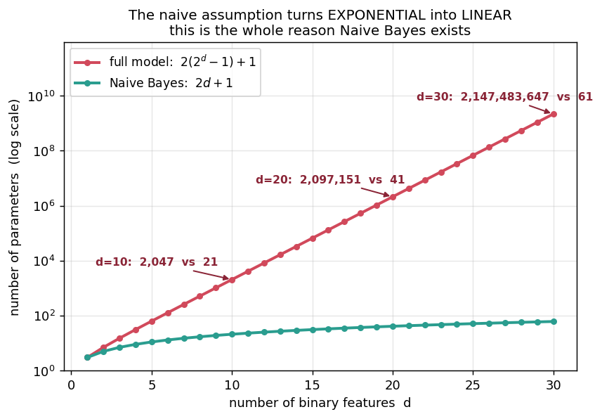
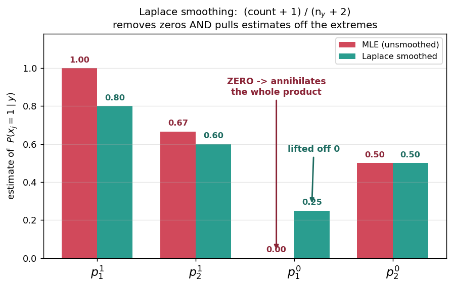
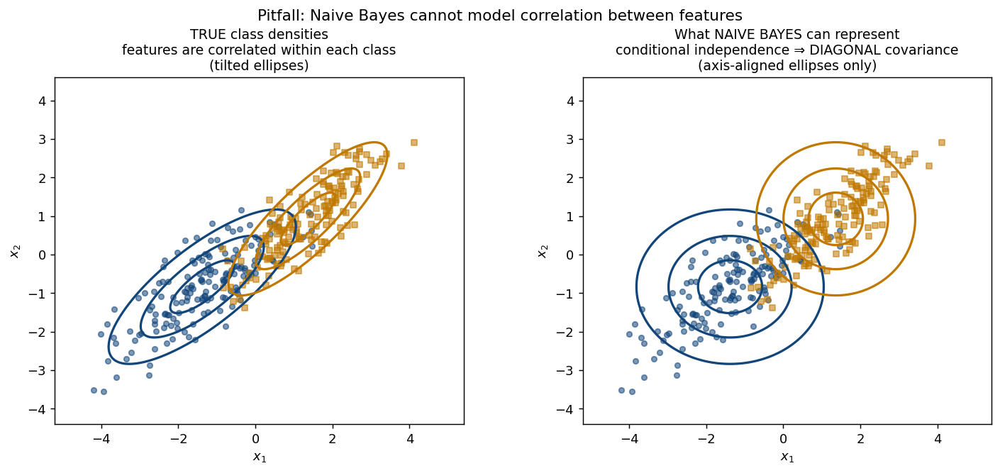
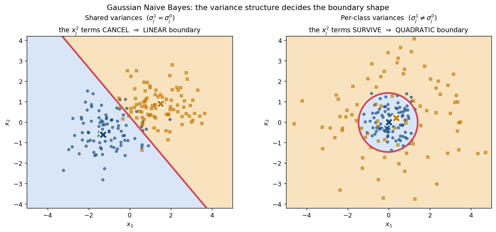

# 📕 Week 8 — Naive Bayes

## 0. Where this sits

Week 7.5 introduced the **generative** idea. Week 8 follows that road all the way to a working algorithm:

```text
Week 7.5:  "generative = model P(x|y) and P(y), then apply Bayes"   ← the idea
Week 8:    let's actually DO it                                      ← the algorithm

8.1-8.2   the honest generative model  →  needs 2ᵈ parameters. Dead on arrival.
8.3       one bold assumption          →  Naive Bayes, only 2d+1 parameters
8.4       what that assumption costs   →  pitfalls (zeros, correlation)
8.5       the surprise                 →  the decision boundary is LINEAR
8.6       continuous features          →  Gaussian Naive Bayes
```

---

## 1. The generative model-based algorithm (8.1)

### The recipe

```text
1. estimate P(y)      ← the class prior
2. estimate P(x | y)  ← the class-conditional distribution
3. classify:  h(x) = argmax_y  P(x | y) · P(y)
```

Concretely for **binary features**: `x ∈ {0,1}ᵈ`, `y ∈ {0,1}`.

### Step 1 — the prior is easy

One parameter, estimated by MLE (Week 4: the Bernoulli MLE is the observed proportion):

```text
p = P(y = 1)          p̂ = (number of samples with y = 1) / n
```

### Step 2 — the class-conditional is the problem

`P(x | y)` is a distribution over **all** of `{0,1}ᵈ`:

```text
possible values of x             =  2ᵈ
probabilities needed             =  2ᵈ  (one per value)
free parameters (they sum to 1)  =  2ᵈ − 1     ...PER CLASS
```

Total for the full honest model:

```text
   2(2ᵈ − 1)  +  1
   └────┬────┘   └┬┘
  two class-       the
  conditionals    prior
```

### 💥 The parameter explosion

| `d` | Full model `2(2ᵈ−1)+1` |
|---|---|
| 3 | 15 |
| 10 | 2,047 |
| 20 | ~2.1 million |
| 30 | ~2.1 **billion** |

Exponential in `d` — and worse than merely "many parameters":

> With `n` samples you observe at most `n` distinct values of `x`, but there are `2ᵈ` of them. So **almost every** `x` gets an estimated probability of **exactly zero**, since the MLE by counting is
> ```text
> P̂(x | y) = (number of times exactly this x appears with label y) / n_y
> ```
> The model cannot generalize — it can only memorize.

---

## 2. An alternate generative model (8.2)

Two framings of the same generative story, side by side:

```text
FRAMING A (one big table)
    pick y ~ Bernoulli(p)
    look up the whole vector x in a 2ᵈ-entry table for that class

FRAMING B (feature by feature)
    pick y ~ Bernoulli(p)
    generate x₁, then x₂, then ... then x_d
```

Framing B decomposes the class-conditional with the **chain rule**:

```text
P(x | y) = P(x₁ | y) · P(x₂ | x₁, y) · P(x₃ | x₁, x₂, y) · ... · P(x_d | x₁,...,x_{d−1}, y)
```

So far this is **exactly equivalent** — no assumption yet, still `2ᵈ − 1` parameters per class (the conditioning sets grow). But it makes the culprit explicit: the **dependence** of each feature on all previous ones.

> 🔑 Delete those dependencies and the product collapses to something tiny. That is §3.

---

## 3. The Naive Bayes algorithm (8.3)

### The assumption

> **Conditional independence:** given the class label, the features are independent.

```text
P(x | y)  =  P(x₁ | y) · P(x₂ | y) · ... · P(x_d | y)  =  Π_j P(xⱼ | y)
```

Read it carefully: independent **given `y`** — *not* independent overall. Two features can be strongly correlated in the pooled data while being independent within each class.

### The new parameter count

```text
p    = P(y = 1)                                 →  1 parameter
pⱼ¹  = P(xⱼ = 1 | y = 1)    for j = 1..d         →  d parameters
pⱼ⁰  = P(xⱼ = 1 | y = 0)    for j = 1..d         →  d parameters
                                                   ──────────────
                                                   2d + 1 total
```



```text
d = 10  :   2,047          →  21          (97× fewer)
d = 30  :   2.1 billion    →  61
```

**Exponential → linear.** That is the entire contribution of the naive assumption.

### MLE estimates — all just counting

```text
p̂     =  n₁ / n                             n₁ = #samples with y = 1

p̂ⱼ¹   =  #(y = 1  AND  xⱼ = 1)  /  n₁       ← among class-1 samples,
                                               the fraction with feature j on

p̂ⱼ⁰   =  #(y = 0  AND  xⱼ = 1)  /  n₀
```

Each is a separate little Bernoulli MLE. No matrix inversion, no gradient descent — **one pass of counting**, making Naive Bayes one of the cheapest models to train in all of ML.

### Prediction

```text
score(y=1)  =  p̂ · Π_j P̂(xⱼ | y=1)
score(y=0)  =  (1−p̂) · Π_j P̂(xⱼ | y=0)

predict whichever is larger
```

where for a binary feature:

```text
P̂(xⱼ | y)  =  (p̂ⱼ^y)^{xⱼ} · (1 − p̂ⱼ^y)^{1 − xⱼ}     ← picks p̂ if xⱼ=1, else 1−p̂
```

### 🧮 Worked example

```text
y = 1:   (1,1),  (1,1),  (1,0)          n₁ = 3
y = 0:   (0,0),  (0,1)                  n₀ = 2
                                        n  = 5
```

**Parameters by counting:**

```text
p̂    = 3/5 = 0.6

p̂₁¹  = P(x₁=1 | y=1) = 3/3 = 1.0       (all class-1 samples have x₁=1)
p̂₂¹  = P(x₂=1 | y=1) = 2/3 ≈ 0.667

p̂₁⁰  = P(x₁=1 | y=0) = 0/2 = 0.0       ⚠️ a ZERO
p̂₂⁰  = P(x₂=1 | y=0) = 1/2 = 0.5
```

**Classify `x = (1,1)`:**

```text
score(y=1) = 0.6 × 1.0 × 0.667 = 0.400
score(y=0) = 0.4 × 0.0 × 0.5   = 0.000     ← annihilated by the zero

⇒ predict y = 1
```

The prediction is right, but `score(y=0)` is *exactly* zero — not small, **impossible**. That is the pitfall in §4.

---

## 4. Pitfalls of Naive Bayes (8.4)

### ⚠️ Pitfall 1: the zero-probability problem

If a feature value never co-occurs with a class in training, its estimate is `0`. Because the scores are a **product**, one zero **annihilates the whole score** regardless of how strongly the other `d−1` features vote:

```text
score = 0.9 × 0.8 × 0.95 × ... × 0  =  0
```

With sparse data (text, for example) this happens constantly.

### The fix: Laplace smoothing (add-one)

Pretend each outcome was seen one extra time:

```text
binary feature:      p̂ⱼ^y  =  (count + 1) / (n_y + 2)

general (K values):  p̂     =  (count + α) / (n_y + α·K)      α = 1 is "Laplace"
```

The `+2` (or `α·K`) keeps it a valid distribution — one phantom observation per possible value.

| Parameter | Unsmoothed | Laplace smoothed |
|---|---|---|
| `p̂₁¹` | `3/3 = 1.0` | `(3+1)/(3+2) = 4/5 = 0.8` |
| `p̂₂¹` | `2/3 = 0.667` | `(2+1)/(3+2) = 3/5 = 0.6` |
| `p̂₁⁰` | `0/2 = 0.0` ⚠️ | `(0+1)/(2+2) = 1/4 = 0.25` ✅ |
| `p̂₂⁰` | `1/2 = 0.5` | `(1+1)/(2+2) = 2/4 = 0.5` |



Re-classify `x = (1,1)`:

```text
score(y=1) = 0.6 × 0.80 × 0.60 = 0.288
score(y=0) = 0.4 × 0.25 × 0.50 = 0.050     ← now nonzero and sensible

⇒ still predict y = 1, but the alternative is no longer "impossible"
```

Smoothing also pulled `p̂₁¹` off the extreme `1.0`. Estimates of exactly 0 **or** exactly 1 are both signs of overconfidence from small counts.

### ⚠️ Pitfall 2: the independence assumption is usually false



Real features are correlated. By construction Naive Bayes models each class with an **axis-aligned** density — it *cannot* represent correlation, so it systematically misfits tilted data.

- **Duplicated evidence.** Near-copy features get counted twice ⇒ overconfidence.
- **Badly calibrated probabilities.** Reported numbers are often far too extreme.

> 🔑 **The crucial nuance:** classification only needs the **argmax** to be right, not the probabilities. The *ranking* of the two scores is often correct even when both are wildly miscalibrated. This is why Naive Bayes works remarkably well in practice — famously on text and spam — despite a plainly false assumption.

### ⚠️ Pitfall 3: numerical underflow

Multiplying `d` probabilities each `< 1` underflows to `0` once `d` is large. **Compute in log space:**

```text
log score(y) = log P(y) + Σ_j log P(xⱼ | y)
```

Sums instead of products, and the argmax is unchanged because `log` is increasing (the same trick as the log-likelihood in Week 4).

---

## 5. The decision function of Naive Bayes (8.5)

Compare the two scores via their **log ratio**, predicting `y = 1` when it is positive:

```text
        P(y=1 | x)
   log ───────────  >  0     ⇔   predict y = 1
        P(y=0 | x)
```

### The derivation

```text
     P(y=1|x)         p        d      P(xⱼ | y=1)
log ─────────  =  log ───  +   Σ  log ────────────
     P(y=0|x)        1−p      j=1     P(xⱼ | y=0)
```

For a binary feature, `P(xⱼ|y) = (pⱼ^y)^{xⱼ}(1−pⱼ^y)^{1−xⱼ}`, so each term is:

```text
              pⱼ¹                    1 − pⱼ¹
   xⱼ · log ─────   +   (1 − xⱼ) · log ─────────
              pⱼ⁰                    1 − pⱼ⁰
```

Grouping the terms that multiply `xⱼ` and those that do not:

```text
     P(y=1|x)
log ─────────  =  w₀  +  Σ_j wⱼ xⱼ
     P(y=0|x)
```

with

```text
             pⱼ¹ (1 − pⱼ⁰)
wⱼ  =  log ─────────────────         ← the log-odds ratio for feature j
             pⱼ⁰ (1 − pⱼ¹)

              p           d      1 − pⱼ¹
w₀  =  log ─────  +       Σ  log ─────────
             1−p         j=1     1 − pⱼ⁰
```

### 🔑 The punchline

> **Naive Bayes with binary features is a LINEAR classifier.**
> ```text
> predict y = 1   ⇔   w^T x + w₀ > 0
> ```

A *generative* model, built purely by counting, with no optimization anywhere — and its decision boundary is a **hyperplane**, exactly like the discriminative linear models. The two camps of Week 7.5 meet here.

Note the elegance of `wⱼ`: it is the **log-odds ratio** of feature `j`. If a feature is equally likely in both classes (`pⱼ¹ = pⱼ⁰`) then `wⱼ = log 1 = 0` and the feature is automatically ignored. Features earn weight in proportion to how *differently* they behave across classes.

### 🧮 Worked example — extract the weights

Using the **smoothed** estimates (`p̂ = 0.6`, `p̂₁¹ = 0.8`, `p̂₂¹ = 0.6`, `p̂₁⁰ = 0.25`, `p̂₂⁰ = 0.5`):

```text
        0.8 × (1 − 0.25)        0.8 × 0.75       0.60
w₁ = log ──────────────── = log ─────────── = log ──── = log 12 = 2.485
        0.25 × (1 − 0.8)       0.25 × 0.20      0.05

        0.6 × (1 − 0.5)         0.6 × 0.5        0.30
w₂ = log ──────────────── = log ─────────── = log ──── = log 1.5 = 0.405
        0.5 × (1 − 0.6)        0.5 × 0.40       0.20

         0.6         1 − 0.8         1 − 0.6
w₀ = log ───  +  log ───────  +  log ───────
         0.4         1 − 0.25        1 − 0.5

   = log 1.5  +  log(0.2/0.75)  +  log(0.4/0.5)
   = 0.405  −  1.322  −  0.223   =  −1.139
```

Cross-check against the direct probability calculation for `x = (1,1)`:

```text
w^T x + w₀  =  2.485 + 0.405 − 1.139  =  +1.751   >  0   ⇒  y = 1  ✓

direct:  log(0.288 / 0.050) = log(5.76) = 1.751   ✓  identical
```

Note `w₁ = 2.485` ≫ `w₂ = 0.405`: feature 1 separated the classes perfectly in training while feature 2 barely differed, and the weights reflect that automatically.

---

## 6. Gaussian Naive Bayes (8.6)

For **continuous** features (`x ∈ ℝᵈ`), keep the independence assumption but swap the Bernoulli for a **Gaussian** per feature:

```text
P(xⱼ | y)  =  N( xⱼ ;  μⱼ^y ,  (σⱼ^y)² )

P(x | y)   =  Π_j  N( xⱼ ;  μⱼ^y , (σⱼ^y)² )
```

Conditional independence means each class is a Gaussian with a **diagonal** covariance matrix — an **axis-aligned** ellipse (exactly the limitation in the §4 figure).

### MLE parameters — per-feature statistics (Week 4 results)

```text
μ̂ⱼ^y      =  mean of feature j among the class-y samples
(σ̂ⱼ^y)²   =  variance of feature j among the class-y samples
p̂         =  n₁ / n
```

### The shape of the boundary — the key exam distinction

Log ratio for one feature, using `log N(x;μ,σ²) = −½log(2πσ²) − (x−μ)²/(2σ²)`:

```text
      σⱼ⁰       (xⱼ − μⱼ¹)²     (xⱼ − μⱼ⁰)²
 log ─────  −  ───────────  +  ───────────
      σⱼ¹       2(σⱼ¹)²         2(σⱼ⁰)²
```

**Case 1 — variances shared across classes** (`σⱼ¹ = σⱼ⁰ = σⱼ`):

```text
  (xⱼ − μⱼ¹)² − (xⱼ − μⱼ⁰)²       −2xⱼ(μⱼ¹ − μⱼ⁰) + (μⱼ¹)² − (μⱼ⁰)²
− ───────────────────────── =  − ─────────────────────────────────────
          2σⱼ²                                 2σⱼ²
```

The `xⱼ²` terms **cancel**, leaving

```text
     μⱼ¹ − μⱼ⁰                             (μⱼ¹)² − (μⱼ⁰)²
wⱼ = ─────────  ,   plus the constant   − ───────────────
       σⱼ²                                     2σⱼ²
```

⇒ **LINEAR** decision boundary.

**Case 2 — variances differ per class** (`σⱼ¹ ≠ σⱼ⁰`):

The `xⱼ²` coefficient is `−1/(2(σⱼ¹)²) + 1/(2(σⱼ⁰)²) ≠ 0`, so the squared terms **survive**.

⇒ **QUADRATIC** decision boundary (a conic: ellipse, parabola or hyperbola).



```text
shared variances across classes   →   LINEAR boundary
per-class variances               →   QUADRATIC boundary
```

This mirrors the classical LDA (linear) vs QDA (quadratic) distinction and is a very common exam question.

---

## 7. Common exam traps

| Question | Answer |
|---|---|
| Parameters for the full generative model (binary `x`)? | `2(2ᵈ − 1) + 1` — **exponential** in `d` |
| Parameters for Naive Bayes? | `2d + 1` — **linear** in `d` |
| What exactly does NB assume? | features are **conditionally independent given `y`** |
| Does it assume features are independent overall? | **No** — only *within* each class |
| Is the assumption usually true? | **No**, but classification often still works (the argmax survives) |
| How are NB parameters estimated? | **counting** (per-feature Bernoulli/Gaussian MLE) — no optimization |
| Prediction rule? | `argmax_y P(y) Π_j P(xⱼ\|y)` |
| Why does one zero ruin everything? | scores are a **product** ⇒ a single 0 annihilates the whole score |
| Fix for zero probabilities? | **Laplace smoothing**: `(count+1)/(n_y+2)` for binary |
| General smoothing denominator? | `n_y + α·K` for `K` feature values |
| Why compute in log space? | avoid **underflow**; `log` is increasing so the argmax is unchanged |
| Shape of the NB decision boundary (binary features)? | **LINEAR** — `w^T x + w₀ > 0` |
| What is `wⱼ`? | `log[ pⱼ¹(1−pⱼ⁰) / (pⱼ⁰(1−pⱼ¹)) ]` — the **log-odds ratio** |
| When is `wⱼ = 0`? | when `pⱼ¹ = pⱼ⁰` (the feature is uninformative) |
| Gaussian NB covariance structure? | **diagonal** ⇒ axis-aligned ellipses |
| Gaussian NB with shared variances? | **LINEAR** boundary |
| Gaussian NB with per-class variances? | **QUADRATIC** boundary |
| Is Naive Bayes generative or discriminative? | **generative** |
