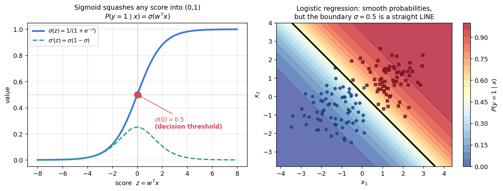

# 📘 Week 9 — Perceptron & Logistic Regression

## 0. The bridge from Week 7

Week 7 established that the **0-1 loss cannot be optimised by gradient descent** (non-convex, non-differentiable). Weeks 9–12 are the answer: algorithms and **smooth surrogate losses** that make classification tractable.

> ⚠️ **Labels change convention here.** The perceptron and SVM use `y ∈ {−1, +1}`; logistic regression uses `y ∈ {0, 1}`. Every formula depends on which one — check before substituting.

---

## 1. The Perceptron (9.1)

```text
predict:   ŷ = sign(w^T x)
mistake:   yᵢ (w^T xᵢ) ≤ 0        ← the margin is negative

ALGORITHM
  w ← 0
  repeat: pick any misclassified point (xᵢ, yᵢ)
          w ← w + yᵢ xᵢ
  until no mistakes remain
```

An **online** algorithm — it processes one point at a time and only acts on mistakes.

## 2. Why the update works (9.2)

Compute the margin of `xᵢ` *after* the update:

```text
yᵢ (w + yᵢ xᵢ)^T xᵢ  =  yᵢ w^T xᵢ  +  yᵢ² ‖xᵢ‖²
                     =  yᵢ w^T xᵢ  +  ‖xᵢ‖²        (since yᵢ² = 1)
```

> 🔑 Each update increases that point's margin by exactly `‖xᵢ‖²` — it always pushes in the right direction. It may break *other* points, which is why we iterate.

## 3. Convergence proof (9.3)

**Assumption (linear separability with margin):** there exists `w*` with `‖w*‖ = 1` and

```text
yᵢ (w*^T xᵢ) ≥ γ > 0    for all i          and let  R = max‖xᵢ‖
```

**Step 1 — the projection onto `w*` grows by at least `γ` per update:**

```text
w*^T w^(t+1) = w*^T w^(t) + yᵢ (w*^T xᵢ)  ≥  w*^T w^(t) + γ
⇒  w*^T w^(t)  ≥  t γ
```

**Step 2 — the norm grows by at most `R²` per update:**

```text
‖w^(t+1)‖² = ‖w^(t)‖² + 2 yᵢ w^(t)T xᵢ + ‖xᵢ‖²
           ≤ ‖w^(t)‖² + 0 + R²
```

The middle term is `≤ 0` **because the point was misclassified** — that is the crux of the proof.

```text
⇒  ‖w^(t)‖²  ≤  t R²
```

**Step 3 — combine with Cauchy–Schwarz:**

```text
t γ  ≤  w*^T w^(t)  ≤  ‖w*‖·‖w^(t)‖  =  ‖w^(t)‖  ≤  √t · R
⇒  √t γ ≤ R
```

```text
                    ┌─────────────────┐
   number of updates│  t  ≤  R² / γ²  │   ← Novikoff / Perceptron Convergence
                    └─────────────────┘
```

**Notes worth memorising:**

- The bound is **independent of `n` and `d`** — it depends only on the geometry (`R`, `γ`).
- Larger margin `γ` ⇒ fewer updates. Bigger data scale `R` ⇒ more updates.
- If the data is **not linearly separable**, the perceptron **never terminates**.

### 🧮 Worked example

`R = 5`, `γ = 0.5`:

```text
t ≤ R²/γ² = 25 / 0.25 = 100 updates
```

## 4. Limitations

| Issue | Consequence |
|---|---|
| Requires linear separability | otherwise loops forever |
| Finds **some** separator | not the best one → Week 10 fixes this |
| Outputs a hard label | no probability → §5 fixes this |

---

## 5. The sigmoid (9.4)

To get a **probability** instead of a hard label, squash the score through the sigmoid:

```text
σ(z) = 1 / (1 + e^(−z))          maps ℝ → (0, 1)
```



Properties to memorise:

```text
σ(0) = 0.5
σ(−z) = 1 − σ(z)
σ'(z) = σ(z)(1 − σ(z))            ← the derivative used by every gradient
σ(z) → 1 as z → +∞ ,  → 0 as z → −∞
```

## 6. Logistic Regression (9.5)

```text
P(y = 1 | x) = σ(w^T x)          P(y = 0 | x) = 1 − σ(w^T x)
```

### The loss: negative log-likelihood = cross-entropy

Do MLE (Week 4 machinery) with `y ∈ {0,1}`:

```text
L(w) = − Σᵢ [ yᵢ log σ(w^T xᵢ)  +  (1 − yᵢ) log(1 − σ(w^T xᵢ)) ]
```

This is the **logistic loss** (also called log loss / cross-entropy).

### The gradient — remarkably clean

```text
∇L(w)  =  Σᵢ ( σ(w^T xᵢ) − yᵢ ) xᵢ        =  Σᵢ (predicted − actual) · xᵢ
```

Update rule: `w ← w − η ∇L`.

### Key properties

| Property | Value |
|---|---|
| Closed form? | ❌ **No** — must use gradient descent |
| Convex? | ✅ **Yes** ⇒ **global** optimum |
| Decision boundary | `σ(w^T x) = 0.5 ⟺ w^T x = 0` → **LINEAR** |
| Log-odds | `log[P(y=1\|x) / P(y=0\|x)] = w^T x` |
| Output | a calibrated **probability** |

### 🔗 The connection back to Week 8

Naive Bayes *also* produced linear log-odds (`w₀ + Σ wⱼ xⱼ`). Same functional form, opposite philosophy:

```text
Naive Bayes           GENERATIVE       fits P(x|y) by counting   → weights fall out
Logistic regression   DISCRIMINATIVE   fits P(y|x) by optimising the loss directly
```

---

## 7. Common exam traps

| Question | Answer |
|---|---|
| Perceptron update rule? | `w ← w + yᵢ xᵢ` on a misclassified point |
| By how much does a point's margin improve? | exactly `‖xᵢ‖²` |
| Convergence bound? | `t ≤ R²/γ²` |
| Does the bound depend on `n` or `d`? | **No** — only on `R` and `γ` |
| What if data is not separable? | perceptron **never converges** |
| Which label convention? | perceptron `{−1,+1}`, logistic `{0,1}` |
| `σ'(z)` = ? | `σ(z)(1 − σ(z))` |
| `σ(−z)` = ? | `1 − σ(z)` |
| Logistic regression closed form? | **No** — gradient descent |
| Logistic regression convex? | **Yes** ⇒ global optimum |
| Logistic gradient? | `Σ(σ(w^Txᵢ) − yᵢ) xᵢ` |
| Logistic decision boundary shape? | **linear** (`w^T x = 0`) |
| What does logistic regression model? | `P(y=1\|x)` — discriminative |
