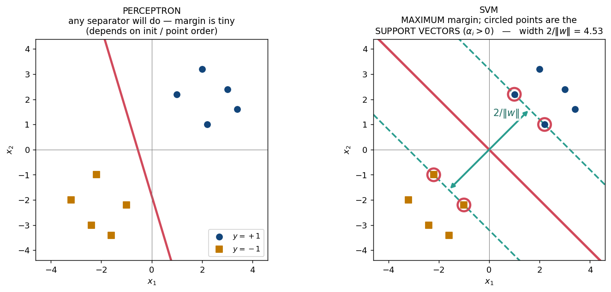
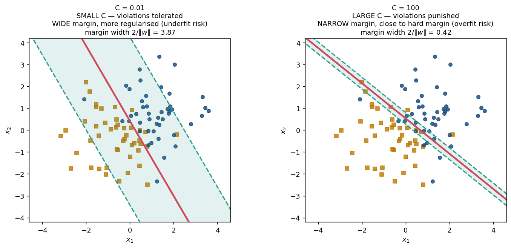

# 📗 Week 10 — Support Vector Machines

## 1. Perceptrons and margin (10.1)

The perceptron stops at the **first** separator it finds — which one depends on initialisation and the order points are visited. Infinitely many separators exist. **Which should we prefer?**



> The one that is **furthest from every point**. Intuition: the widest buffer is the most robust to noise and generalises best.

**Margin** = distance from the hyperplane to the nearest data point.

Distance from `xᵢ` to the hyperplane `w^T x + b = 0`:

```text
|w^T xᵢ + b| / ‖w‖
```

## 2. Max-margin formulation (10.2)

The scale of `(w, b)` is arbitrary (multiplying both by 2 gives the same boundary), so **fix the scale** by requiring the closest points to satisfy `|w^T x + b| = 1`. Then:

```text
margin on each side = 1/‖w‖              total width = 2/‖w‖
```

Maximising `2/‖w‖` is minimising `‖w‖`, and minimising `‖w‖` is minimising `½‖w‖²` (nicer to differentiate):

```text
        ┌───────────────────────────────────────────┐
        │  min   ½ ‖w‖²                             │
        │  s.t.  yᵢ(w^T xᵢ + b) ≥ 1   for all i     │   ← HARD MARGIN SVM
        └───────────────────────────────────────────┘
```

Convex quadratic objective + linear constraints ⇒ a **unique global optimum** (unlike the perceptron, whose answer depends on the run).

## 3. Constrained optimisation → the dual (10.3–10.4)

Introduce Lagrange multipliers `αᵢ ≥ 0`, one per constraint:

```text
L(w, b, α) = ½‖w‖² − Σᵢ αᵢ [ yᵢ(w^T xᵢ + b) − 1 ]
```

Set the derivatives to zero (**stationarity**):

```text
∂L/∂w = 0   ⇒   w = Σᵢ αᵢ yᵢ xᵢ        ← w is a linear combination of the DATA
∂L/∂b = 0   ⇒   Σᵢ αᵢ yᵢ = 0
```

Substituting back eliminates `w` and `b`, giving the **dual problem**:

```text
        max_α   Σᵢ αᵢ  −  ½ ΣᵢΣⱼ αᵢ αⱼ yᵢ yⱼ (xᵢ^T xⱼ)
        s.t.    αᵢ ≥ 0 ,      Σᵢ αᵢ yᵢ = 0
```

### 🔑 Two payoffs from the dual

**1. The kernel trick applies.** The data appears *only* as inner products `xᵢ^T xⱼ`, so replace them with `K(xᵢ, xⱼ)` and you get a **non-linear** SVM for free.

```text
This is the THIRD appearance of the kernel trick:
    Week 2   Kernel PCA           (n × n Gram matrix)
    Week 5   Kernel regression    (α = K⁻¹y)
    Week 10  Kernel SVM           (dual depends only on xᵢ^T xⱼ)
```

**2. The solution is sparse** in `α` — see §4.

## 4. Support vectors (10.5)

```text
αᵢ > 0   ⇒   xᵢ is a SUPPORT VECTOR, lying exactly ON the margin boundary
αᵢ = 0   ⇒   xᵢ is irrelevant; deleting it would not change the solution
```

This follows from **KKT complementary slackness**:

```text
αᵢ [ yᵢ(w^T xᵢ + b) − 1 ] = 0        for every i
```

Either `αᵢ = 0`, or the bracket is zero (the point sits exactly on the margin).

Recovering the parameters:

```text
w = Σᵢ αᵢ yᵢ xᵢ            (only support vectors contribute)
b = yᵢ − w^T xᵢ            (using any support vector)
```

> Typically only a handful of points are support vectors, so the model is compact — a genuine practical advantage over KNN, which must keep every point.

### 🧮 Worked example

Two points: `x₁ = (1,1)` with `y=+1`, and `x₂ = (−1,−1)` with `y=−1`.

```text
By symmetry b = 0 and w ∝ (1,1).

Constraints:  y₁(w^T x₁) = w₁ + w₂ ≥ 1
              y₂(w^T x₂) = −(−w₁ − w₂) = w₁ + w₂ ≥ 1

minimise ½(w₁² + w₂²) subject to w₁ + w₂ ≥ 1
⇒ by symmetry w₁ = w₂ = 0.5      so  w = (0.5, 0.5)

‖w‖ = √0.5 ≈ 0.707
margin width = 2/‖w‖ = 2√2 ≈ 2.83
```

Sanity check: the distance between the two points is `‖(2,2)‖ = 2√2` ✓ — with only two points the margin spans the whole gap. **Both points are support vectors.**

## 5. Soft margin SVM (10.6)

Real data is rarely separable, and one outlier would make the hard-margin problem **infeasible**. Allow violations via **slack variables** `ξᵢ ≥ 0`:

```text
        ┌──────────────────────────────────────────────────┐
        │  min   ½‖w‖²  +  C Σᵢ ξᵢ                         │
        │  s.t.  yᵢ(w^T xᵢ + b) ≥ 1 − ξᵢ ,   ξᵢ ≥ 0        │
        └──────────────────────────────────────────────────┘
```

Interpreting the slack:

```text
ξᵢ = 0          correctly classified, outside the margin
0 < ξᵢ ≤ 1      inside the margin but still on the correct side
ξᵢ > 1          MISCLASSIFIED
```

### Equivalent hinge-loss form

Since the optimal `ξᵢ = max(0, 1 − yᵢ(w^T xᵢ + b))`:

```text
min   ½‖w‖²   +   C Σᵢ max(0, 1 − yᵢ(w^T xᵢ + b))
      └─regulariser─┘   └────────── hinge loss ──────────┘
```

> This is the same *regulariser + loss* shape as ridge regression (Week 6). SVM = ℓ2 regularisation + hinge loss.

### The role of C



| `C` | Behaviour |
|---|---|
| **large** | violations heavily punished → **narrow** margin → approaches hard margin, **overfits** |
| **small** | violations tolerated → **wide** margin → more regularisation, **underfits** |

`C` is chosen by **cross-validation** (Week 6's tool again).

```text
C → ∞   recovers the hard-margin SVM
```

---

## 6. Common exam traps

| Question | Answer |
|---|---|
| SVM primal objective? | `min ½‖w‖²` s.t. `yᵢ(w^Txᵢ+b) ≥ 1` |
| Margin width? | `2/‖w‖` (each side `1/‖w‖`) |
| Why minimise `‖w‖`? | maximising the margin `2/‖w‖` is the same thing |
| Why the constraint `≥ 1`? | fixes the arbitrary scale of `(w,b)` |
| `w` in terms of the dual? | `w = Σᵢ αᵢ yᵢ xᵢ` |
| The dual's equality constraint? | `Σᵢ αᵢ yᵢ = 0` |
| Which points have `αᵢ > 0`? | **support vectors**, exactly on the margin |
| Effect of deleting a non-support vector? | **none** |
| Why can SVM be kernelised? | the dual uses only inner products `xᵢ^T xⱼ` |
| Is the SVM solution unique? | **Yes** — convex QP ⇒ global optimum |
| Soft margin objective? | `min ½‖w‖² + C Σ ξᵢ` |
| Equivalent loss? | **hinge loss** `max(0, 1 − y f(x))` |
| `ξᵢ > 1` means? | the point is **misclassified** |
| Large vs small `C`? | large = narrow margin/overfit; small = wide margin/underfit |
| How is `C` chosen? | **cross-validation** |
