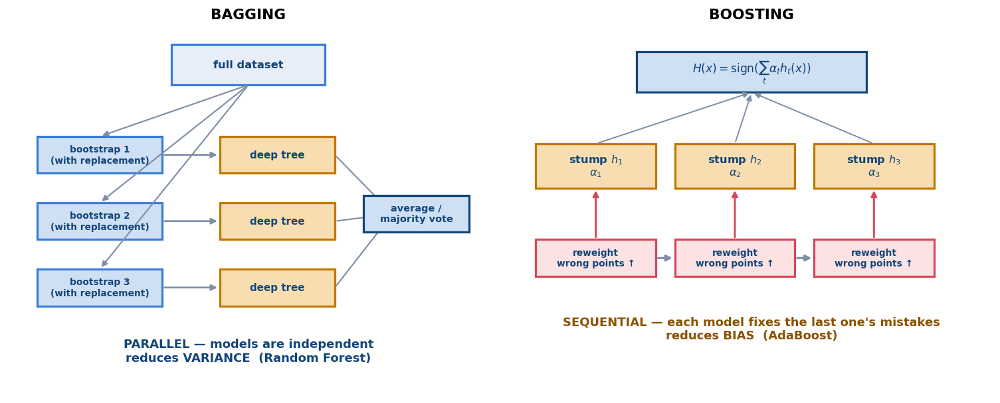

# 📙 Week 11 — Soft-Margin Dual, Bagging & Boosting

## 1. Dual formulation for soft-margin SVM (11.1)

Same Lagrangian machinery as Week 10, now with the slack constraints included. The result:

```text
        max_α   Σᵢ αᵢ  −  ½ ΣᵢΣⱼ αᵢ αⱼ yᵢ yⱼ (xᵢ^T xⱼ)
        s.t.    0 ≤ αᵢ ≤ C ,        Σᵢ αᵢ yᵢ = 0
                     └──┬──┘
              the ONLY change from hard margin: a BOX constraint
```

> 🔑 **The single most examinable fact in 11.1:** the soft-margin dual is *identical* to the hard-margin dual except that `αᵢ` is now capped at `C`. The objective function does not change at all.

```text
hard margin:   αᵢ ≥ 0            (unbounded above)
soft margin:   0 ≤ αᵢ ≤ C        (bounded — "box constraint")
C → ∞  recovers the hard-margin dual
```

Because the objective still only involves `xᵢ^T xⱼ`, the **kernel trick still applies**.

## 2. Complementary slackness (11.2)

The KKT conditions partition every training point into exactly **three cases** by the value of `αᵢ`. This table is a guaranteed exam question:

| `αᵢ` | Where the point lies | `ξᵢ` | Support vector? |
|---|---|---|---|
| `αᵢ = 0` | correctly classified, **outside** the margin (`yᵢ f(xᵢ) > 1`) | `0` | ❌ no |
| `0 < αᵢ < C` | exactly **on** the margin (`yᵢ f(xᵢ) = 1`) | `0` | ✅ yes |
| `αᵢ = C` | **inside/violating** the margin (`yᵢ f(xᵢ) < 1`) | `> 0` | ✅ yes |

Reading it in reverse (the direction exams usually ask):

```text
yᵢ f(xᵢ) > 1   ⇒  αᵢ = 0
yᵢ f(xᵢ) = 1   ⇒  0 ≤ αᵢ ≤ C
yᵢ f(xᵢ) < 1   ⇒  αᵢ = C        and ξᵢ = 1 − yᵢ f(xᵢ) > 0
ξᵢ > 1         ⇒  the point is misclassified
```

Useful consequence: to compute `b`, use a point with `0 < αᵢ < C` (it lies exactly on the margin, so `b = yᵢ − w^T xᵢ`). Points at `αᵢ = C` do **not** satisfy `yᵢ f(xᵢ) = 1` and cannot be used.

## 3. Summary for soft-margin SVM (11.3)

```text
PRIMAL      min ½‖w‖² + C Σ ξᵢ    s.t. yᵢ(w^T xᵢ + b) ≥ 1 − ξᵢ,  ξᵢ ≥ 0
            ⇔  min ½‖w‖² + C Σ max(0, 1 − yᵢ(w^T xᵢ + b))       (hinge form)

DUAL        max Σ αᵢ − ½ ΣΣ αᵢαⱼ yᵢyⱼ K(xᵢ,xⱼ)
            s.t. 0 ≤ αᵢ ≤ C,  Σ αᵢyᵢ = 0

RECOVER     w = Σᵢ αᵢ yᵢ xᵢ  ;  b from any i with 0 < αᵢ < C
PREDICT     f(x) = Σᵢ αᵢ yᵢ K(xᵢ, x) + b  ;  ŷ = sign f(x)
```

---

## 4. Overfitting and underfitting (11.4)

```text
UNDERFIT (high bias)                 OVERFIT (high variance)
─────────────────────                ────────────────────────
small C, shallow tree,               large C, deep tree,
large λ, large k                     k = 1, small λ
train error HIGH                     train error ≈ 0
test  error HIGH                     test  error HIGH
```

The two cures are exactly §5 and §6:

```text
high VARIANCE  →  BAGGING    (average many complex models)
high BIAS      →  BOOSTING   (combine many simple models sequentially)
```



## 5. Bagging — Bootstrap Aggregating (11.5)

```text
for b = 1 .. B:
    draw a BOOTSTRAP sample of n points, sampling WITH REPLACEMENT
    train a model on that sample
aggregate:   average (regression)   /   majority vote (classification)
```

**Key properties:**

- Reduces **variance**; leaves bias roughly unchanged.
- Therefore use **high-variance, low-bias** base models → **deep decision trees**.
- Models are **independent** ⇒ **trainable in parallel**.
- Averaging `B` roughly independent models with variance `σ²` gives variance `≈ σ²/B`.

**How much data does each bootstrap sample see?**

```text
P(a given point is NOT picked in n draws) = (1 − 1/n)ⁿ  →  1/e ≈ 0.368

⇒ each sample contains ≈ 63.2% of the distinct points
⇒ the left-out ≈36.8% form the OUT-OF-BAG (OOB) set → free validation data
```

**Random Forest = bagging + a random subset of features considered at each split.** The extra randomness *decorrelates* the trees, which reduces variance further than bagging alone (averaging helps most when the models are less correlated).

## 6. Boosting (11.6)

```text
sequential: each new model concentrates on the examples the previous ones got WRONG
```

- Reduces **bias** (and variance somewhat).
- Uses **weak learners** — high-bias models such as **decision stumps** (depth-1 trees).
- Models are **dependent** ⇒ **cannot be parallelised**.

### AdaBoost

```text
initialise weights   D₁(i) = 1/n

for t = 1 .. T:
    train weak classifier h_t using the weights D_t
    weighted error:      ε_t = Σᵢ D_t(i) · 𝟙(h_t(xᵢ) ≠ yᵢ)

                          1        1 − ε_t
    classifier weight:   α_t = ─── ln ─────────
                              2         ε_t

    reweight:   D_{t+1}(i)  ∝  D_t(i) · exp( −α_t yᵢ h_t(xᵢ) )
                ↑ misclassified points get MORE weight, correct ones LESS
                (then renormalise so the weights sum to 1)

final classifier:   H(x) = sign( Σ_t α_t h_t(x) )
```

Behaviour of `α_t`:

```text
ε_t < 0.5   ⇒  α_t > 0      better than random → gets positive weight
ε_t = 0.5   ⇒  α_t = 0      no better than a coin flip → ignored entirely
ε_t → 0     ⇒  α_t → ∞      near-perfect → dominates the vote
ε_t > 0.5   ⇒  α_t < 0      worse than random → its prediction is FLIPPED
```

### 🧮 Worked example

`ε_t = 0.2`:

```text
α_t = ½ ln(0.8 / 0.2) = ½ ln 4 = ½ (1.386) = 0.693
```

(`ε_t = 0.3` → `α_t = ½ ln(7/3) = 0.424`;  `ε_t = 0.5` → `α_t = 0`.)

## 7. Bagging vs Boosting — memorise this

| | **Bagging** | **Boosting** |
|---|---|---|
| Training | **parallel** (independent) | **sequential** (dependent) |
| Base learner | strong, **deep** trees | weak, **stumps** |
| Primarily reduces | **variance** | **bias** |
| How data is varied | bootstrap resampling | **reweighting** |
| Aggregation | equal vote / plain average | **weighted** vote (`α_t`) |
| Overfitting | quite resistant | can overfit with too many rounds |
| Noise/outliers | robust | **sensitive** (exponential loss) |
| Canonical example | **Random Forest** | **AdaBoost** |

---

## 8. Common exam traps

| Question | Answer |
|---|---|
| Difference between hard- and soft-margin dual? | only the **box constraint** `αᵢ ≤ C` |
| Does the dual objective change for soft margin? | **No** |
| `αᵢ = 0` means? | correctly classified, outside the margin |
| `0 < αᵢ < C` means? | exactly **on** the margin, `ξᵢ = 0` |
| `αᵢ = C` means? | margin violator, `ξᵢ > 0` |
| Which points give a valid `b`? | those with `0 < αᵢ < C` |
| When is a point misclassified? | `ξᵢ > 1` |
| Bagging reduces which error component? | **variance** |
| Boosting reduces which? | **bias** |
| Which can be parallelised? | **bagging** only |
| Base learner for bagging / boosting? | deep trees / **stumps** |
| Fraction of unique points per bootstrap? | ≈ **63.2%** (`1 − 1/e`) |
| What is OOB used for? | free **validation** on the ~36.8% left out |
| Random Forest adds what to bagging? | **random feature subsets** at each split (decorrelation) |
| AdaBoost `α_t` formula? | `½ ln((1−ε_t)/ε_t)` |
| `ε_t = 0.5` ⇒ `α_t` = ? | **0** (useless classifier, ignored) |
| Which is sensitive to noisy labels? | **boosting** (exponential loss) |
