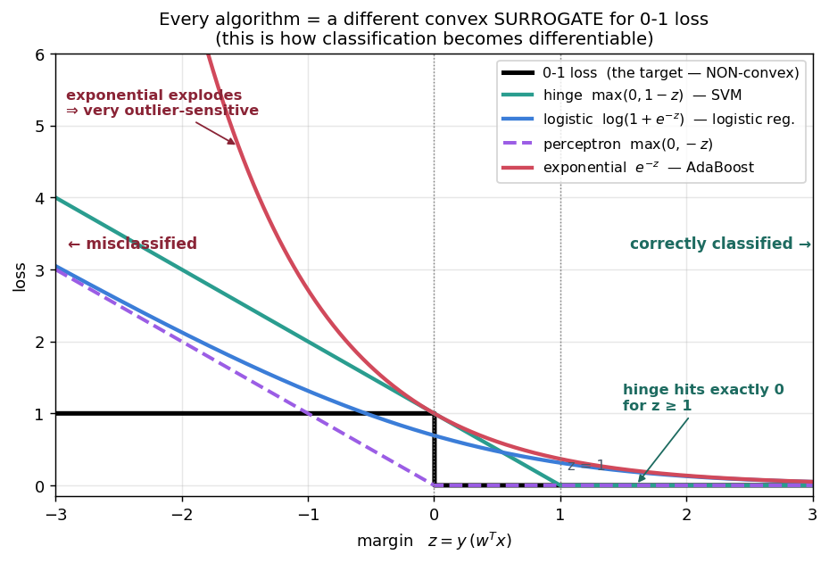
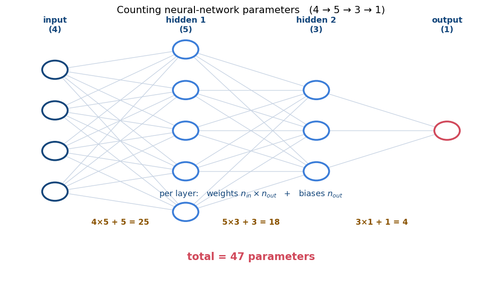

# 📕 Week 12 — Loss Functions & Neural Networks

## 1. Classification loss functions (12.1)

This section **closes the loop opened in Week 7**: the 0-1 loss is non-convex and non-differentiable, so every practical algorithm optimises a **convex surrogate** instead.

Define the **margin** of a point:

```text
z = y · (w^T x)          z > 0 ⇔ correctly classified
                         larger z ⇔ more confidently correct
```

Every loss below is written as a function of `z` alone.



| Loss | Formula | Used by |
|---|---|---|
| **0-1** | `𝟙(z ≤ 0)` | the ideal target — **non-convex** ❌ |
| **Hinge** | `max(0, 1 − z)` | **SVM** (Weeks 10–11) |
| **Logistic** | `log(1 + e^(−z))` | **Logistic regression** (Week 9) |
| **Perceptron** | `max(0, −z)` | **Perceptron** (Week 9) |
| **Exponential** | `e^(−z)` | **AdaBoost / Boosting** (Week 11) |
| Squared | `(1 − z)²` | poor choice for classification |

> 🔑 **Every surrogate above is convex** — that is precisely what makes gradient-based optimisation possible, and it is why each algorithm in Weeks 9–11 exists: they are the *same idea* with a different loss.

⚠️ **Be precise about the "upper bound" claim** — a sweeping version of it is false:

```text
hinge, exponential          genuine upper bounds on 0-1 loss ✅
logistic  log₂(1 + e^(−z))  an upper bound in BASE 2 (equals exactly 1 at z = 0) ✅
logistic  log(1 + e^(−z))   NOT an upper bound: log 2 = 0.693 < 1 at z = 0 ❌
perceptron  max(0, −z)      NOT an upper bound: equals 0 at z = 0 ❌
```

The two natural-log/perceptron cases fail only in a small region around `z = 0`. Textbooks that state "all surrogates upper-bound the 0-1 loss" are implicitly using `log₂` for the logistic loss. If asked, the safe answer is: *they are convex surrogates; hinge and exponential upper-bound 0-1 loss, and logistic does too in base 2.*

## 2. SVM and logistic loss (12.2)

```text
hinge:      max(0, 1 − z)          logistic:   log(1 + e^(−z))
```

| | Hinge (SVM) | Logistic |
|---|---|---|
| Value for `z ≥ 1` | **exactly 0** | small but **never 0** |
| Differentiable everywhere? | ❌ kink at `z = 1` | ✅ smooth |
| Effect | well-classified points contribute **nothing** ⇒ sparse support vectors | *every* point keeps nudging `w` |
| Output | a decision only | a calibrated **probability** |

> That "exactly 0 beyond the margin" property is *why* SVMs have **support vectors**: points beyond the margin contribute zero loss and zero gradient, so they can be deleted without changing the solution.

## 3. Perceptron and boosting loss (12.3)

```text
perceptron:   max(0, −z)       exponential:   e^(−z)
```

- **Perceptron loss** is the hinge loss with the margin requirement dropped (`1 → 0`). It is `0` as soon as a point is *just barely* correct, which is why the perceptron accepts any separator rather than the widest one.
- **Exponential loss** grows *fastest* of all as `z → −∞`:

```text
z = −1  →  e¹  = 2.72
z = −3  →  e³  = 20.1
z = −5  →  e⁵  = 148.4        ← a single mislabelled point can dominate
```

> ⇒ **AdaBoost is very sensitive to noisy labels and outliers.** This is a standard exam point, and it follows directly from the shape of the loss.

**Why squared loss is wrong for classification:** `(1 − z)²` *increases* again for `z > 1`, so it penalises points that are "too correct" — the model is pushed to make confident predictions less confident.

---

## 4. Neural Networks (12.4)

**Motivation:** a linear model cannot represent **XOR**. Kernels solved this by *hand-choosing* a feature map `φ`. Neural networks instead **learn the features** from data.

```text
one layer:    a^(l) = g( W^(l) a^(l−1) + b^(l) )

              g = activation function, applied elementwise
```

### Activations

```text
sigmoid  σ(z) = 1/(1+e^(−z))     output in (0,1), saturates (vanishing gradients)
tanh(z)                           output in (−1,1), zero-centred
ReLU     max(0, z)                cheap, no saturation for z > 0 — the default
```

### Output layer by task

```text
binary classification  →  sigmoid        (1 unit)
multi-class            →  softmax        (one unit per class)
regression             →  linear / none
```

### Training

```text
FORWARD PROPAGATION    compute layer by layer to get the prediction and the loss
BACKPROPAGATION        apply the CHAIN RULE backwards to get every gradient
                       then update with gradient descent
```

Backpropagation is **not** a new optimiser — it is just an efficient way to compute `∇L` for a composed function.

### ⚠️ The key theoretical difference from everything else in the course

```text
Neural networks are NON-CONVEX  ⇒  gradient descent reaches only a LOCAL minimum
```

| Method | Convex? | Optimum |
|---|---|---|
| Linear / ridge / lasso regression | ✅ | global |
| Logistic regression | ✅ | global |
| SVM (hard & soft) | ✅ | global |
| **Neural network** | ❌ | **local** |

**Universal approximation theorem:** a network with a *single* hidden layer and enough hidden units can approximate any continuous function to arbitrary accuracy. (Existence only — it says nothing about how many units are needed, or whether training will find it.)

## 5. Computing the parameters of a network (12.5)



```text
for a layer mapping n_in inputs → n_out outputs:

    weights = n_in × n_out
    biases  = n_out
    ────────────────────────────────
    total   = n_in × n_out + n_out  =  n_out (n_in + 1)
```

Sum over all layers.

### 🧮 Worked example — architecture `4 → 5 → 3 → 1`

```text
layer 1 (4 → 5):   4 × 5 + 5  =  20 + 5  =  25
layer 2 (5 → 3):   5 × 3 + 3  =  15 + 3  =  18
layer 3 (3 → 1):   3 × 1 + 1  =   3 + 1  =   4
                                            ────
                                    total =  47 parameters
```

> ⚠️ **The trap:** forgetting the biases. Weights alone give `20 + 15 + 3 = 38`; the correct answer is `47`.

## 6. Summary of the course (12.6)

```text
UNSUPERVISED                              SUPERVISED
────────────                              ──────────
W1-2  PCA → Kernel PCA                    W5    Linear & kernel regression
W3    K-means clustering                  W6    Ridge & lasso (regularisation)
W4    MLE / Bayesian / GMM-EM             W7    KNN, decision trees
                                          W8    Naive Bayes
                                          W9    Perceptron, logistic regression
                                          W10-11 SVM (hard, soft, dual), ensembles
                                          W12   Surrogate losses, neural networks
```

Three ideas recur across the whole course:

```text
1. THE KERNEL TRICK      Week 2 (PCA) → Week 5 (regression) → Week 10 (SVM)
                         always: replace xᵢ^T xⱼ with K(xᵢ, xⱼ)

2. MLE / BAYES           Week 4 → squared error (W5), ridge & lasso priors (W6),
                         Naive Bayes (W8), logistic loss (W9)

3. REGULARISER + LOSS    ridge = ℓ2 + squared     lasso = ℓ1 + squared
                         SVM   = ℓ2 + hinge       logistic reg. = logistic loss
```

---

## 7. Common exam traps

| Question | Answer |
|---|---|
| Why use surrogate losses at all? | 0-1 loss is **non-convex, non-differentiable** |
| Are all the surrogates convex? | **Yes** |
| Are they all *upper bounds* on 0-1 loss? | **No** — hinge & exponential are; logistic is in **base 2**; perceptron loss is **not** (it is 0 at `z=0`) |
| Hinge loss formula and owner? | `max(0, 1 − z)` — **SVM** |
| Logistic loss formula and owner? | `log(1 + e^(−z))` — **logistic regression** |
| Perceptron loss? | `max(0, −z)` |
| Exponential loss and owner? | `e^(−z)` — **AdaBoost** |
| Which loss is exactly 0 for `z ≥ 1`? | **hinge** (⇒ support vectors) |
| Which loss is never exactly 0? | **logistic** |
| Which loss is most outlier-sensitive? | **exponential** |
| Why is squared loss bad for classification? | it penalises points that are **too correct** (`z > 1`) |
| What does backpropagation do? | computes gradients via the **chain rule** |
| Is a neural network convex? | **No** ⇒ only a **local** minimum |
| Which methods are convex? | linear/ridge/lasso, logistic regression, SVM |
| Universal approximation theorem? | one hidden layer with enough units approximates any continuous function |
| Parameters in a layer `n_in → n_out`? | `n_in × n_out + n_out` |
| Params for `4 → 5 → 3 → 1`? | `25 + 18 + 4 = **47**` |
| Most common parameter-counting mistake? | **forgetting the biases** |
